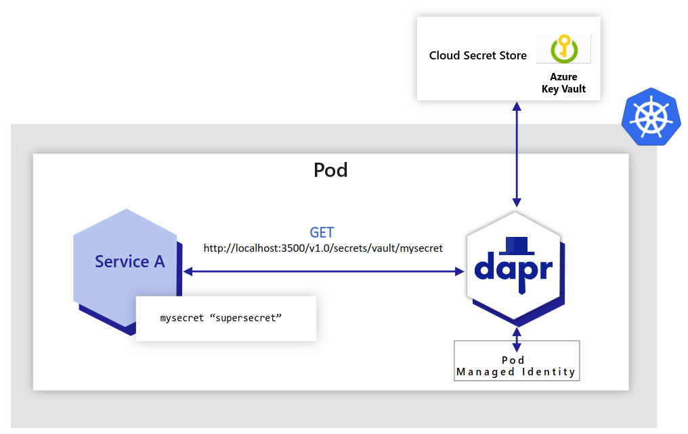
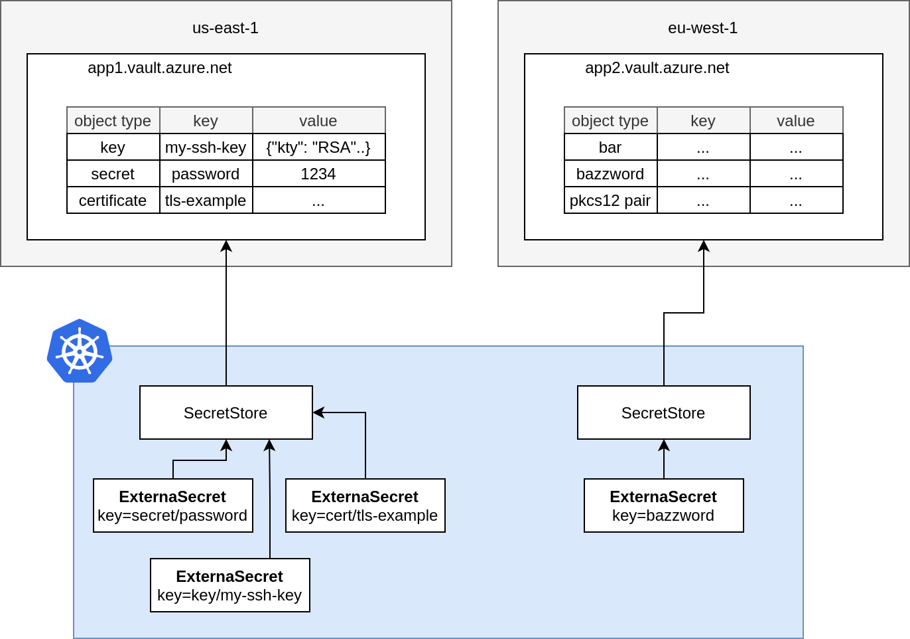

# Reading Secrets from Azure Key Vault in Azure Kubernetes Service (AKS)

In this article, we will explore various mechanisms that an application hosted on Azure Kubernetes Service (AKS) can use to retrieve secrets from an [Azure Key Vault](https://learn.microsoft.com/en-us/azure/key-vault/general/basic-concepts) resource.

## Microsoft Entra Workload ID with Azure Kubernetes Service (AKS)

In order for workloads deployed on an [Azure Kubernetes Services (AKS)](https://learn.microsoft.com/en-us/azure/aks/what-is-aks) cluster to access protected resources like [Azure Key Vault](https://learn.microsoft.com/en-us/azure/key-vault/general/basic-concepts) and Microsoft Graph, they need to have Microsoft Entra application credentials or managed identities. [Microsoft Entra Workload ID](https://learn.microsoft.com/en-us/azure/aks/workload-identity-overview) integrates with Kubernetes to federate with external identity providers.

To enable pods to have a Kubernetes identity, [Microsoft Entra Workload ID](https://learn.microsoft.com/en-us/azure/aks/workload-identity-overview) utilizes Service Account Token Volume Projection. This means that a Kubernetes token is issued and OIDC federation enables Kubernetes applications to securely access Azure resources using Microsoft Entra ID, based on service account annotations.

As shown in the following diagram, the Kubernetes cluster becomes a security token issuer, issuing tokens to Kubernetes Service Accounts. These tokens can be configured to be trusted on Microsoft Entra applications and user-defined managed identities. They can then be exchanged for an Microsoft Entra access token using the [Azure Identity SDKs](https://docs.microsoft.com/en-us/dotnet/api/overview/azure/identity-readme) or the [Microsoft Authentication Library (MSAL)](https://github.com/AzureAD/microsoft-authentication-library-for-dotnet).

[

In the [Microsoft Entra ID](https://learn.microsoft.com/en-us/entra/fundamentals/whatis) platform, there are two kinds of workload identities:

- [Registered applications](https://learn.microsoft.com/en-us/entra/identity-platform/application-model) have several powerful features, such as multi-tenancy and user sign-in. These capabilities cause application identities to be closely guarded by administrators. For more information on how to implement workload identity federation with registered applications, see [Use Microsoft Entra Workload Identity for Kubernetes with a User-Assigned Managed Identity](https://techcommunity.microsoft.com/t5/fasttrack-for-azure/use-azure-ad-workload-identity-for-kubernetes-in-a-net-standard/ba-p/3576218).

- [Managed identities](https://learn.microsoft.com/en-us/azure/active-directory/managed-identities-azure-resources/overview) provide an automatically managed identity in Microsoft Entra ID for applications to use when connecting to resources that support Microsoft Entra ID authentication. Applications can use managed identities to obtain Microsoft Entra tokens without having to manage any credentials. Managed identities were built with developer scenarios in mind. They support only the Client Credentials flow meant for software workloads to identify themselves when accessing other resources. For more information on how to implement workload identity federation with registered applications, see [Use Azure AD Workload Identity for Kubernetes with a User-Assigned Managed Identity](https://techcommunity.microsoft.com/blog/fasttrackforazureblog/use-azure-ad-workload-identity-for-kubernetes-with-a-user-assigned-managed-ident/3654928#M270).

### Advantages

- Transparently assigns a user-defined managed identity to a pod or deployment.
- Allows using Microsoft Entra integrated security and Azure RBAC for authorization.
- Provides secure access to Azure Key Vault and other managed services.

### Disadvantages

- Requires using Azure libraries for acquiring Azure credentials and using them to access managed services.
- Requires code changes.

### Resources

- [Use Microsoft Entra Workload ID with Azure Kubernetes Service (AKS)](https://learn.microsoft.com/en-us/azure/aks/workload-identity-overview)
- [Deploy and Configure an AKS Cluster with Workload Identity](https://learn.microsoft.com/en-us/azure/aks/workload-identity-deploy-cluster)
- [Configure Cross-Tenant Workload Identity on AKS](https://learn.microsoft.com/en-us/azure/aks/workload-identity-cross-tenant)
- [Use Microsoft Entra Workload ID with a User-Assigned Managed Identity in an AKS-hosted .NET Application](https://github.com/paolosalvatori/azure-ad-workload-identity-mi)

## Azure Key Vault Provider for Secrets Store CSI Driver in AKS

The [Azure Key Vault provider for Secrets Store CSI Driver](https://learn.microsoft.com/en-us/azure/aks/csi-secrets-store-driver) enables retrieving secrets, keys, and certificates stored in Azure Key Vault and accessing them as files from mounted volumes in an AKS cluster. This mechanism eliminates the need for Azure-specific libraries to access the secrets.

This [Secret Store CSI Driver for Key Vault](https://github.com/Azure/secrets-store-csi-driver-provider-azure) offers the following features:

- Mounts secrets, keys, and certificates to a pod using a CSI volume.
- Supports CSI inline volumes.
- Allows the mounting of multiple secrets store objects as a single volume.
- Offers pod portability with the SecretProviderClass CRD.
- Compatible with Windows containers.
- Keeps in sync with Kubernetes secrets.
- Supports auto-rotation of mounted contents and synced Kubernetes secrets.

When auto-rotation is enabled for the Azure Key Vault Secrets Provider, it automatically updates both the pod mount and the corresponding Kubernetes secret defined in the **secretObjects** field of SecretProviderClass. It continuously polls for changes based on the rotation poll interval (default is two minutes).

If a secret in an external secrets store is updated after the initial deployment of the pod, both the Kubernetes Secret and the pod mount will periodically update, depending on how the application consumes the secret data. Here are the recommended approaches for different scenarios:

1. Mount the Kubernetes Secret as a volume: Utilize the auto-rotation and sync K8s secrets features of Secrets Store CSI Driver. The application should monitor changes from the mounted Kubernetes Secret volume. When the CSI Driver updates the Kubernetes Secret, the volume contents will be automatically updated.
2. Application reads data from the container filesystem: Take advantage of the rotation feature of Secrets Store CSI Driver. The application should monitor file changes from the volume mounted by the CSI driver.
3. Use the Kubernetes Secret for an environment variable: Restart the pod to acquire the latest secret as an environment variable. You can use tools like Reloader to watch for changes on the synced Kubernetes Secret and perform rolling upgrades on pods.

### Advantages

- Secrets, keys, and certificates can be accessed as files from mounted volumes.
- Optionally, Kubernetes secrets can be created to store keys, secrets, and certificates from Key Vault.
- No need for Azure-specific libraries to access secrets.
- Simplifies secret management with transparent integration.

### Disadvantages

- Still requires accessing managed services such as Azure Service Bus or Azure Storage using their own connection strings from Azure Key Vault.
- Cannot utilize Microsoft Entra ID integrated security and managed identities for accessing managed services.

### Resources

- [Using the Azure Key Vault Provider for Secrets Store CSI Driver in AKS](https://learn.microsoft.com/en-us/azure/aks/csi-secrets-store-driver)
- [Access Azure Key Vault with the CSI Driver Identity Provider](https://learn.microsoft.com/en-us/azure/aks/csi-secrets-store-identity-access?tabs=azure-portal&pivots=access-with-service-connector)
- [Configuration and Troubleshooting Options for Azure Key Vault Provider in AKS](https://learn.microsoft.com/en-us/azure/aks/csi-secrets-store-configuration-options)
- [Azure Key Vault Provider for Secrets Store CSI Driver](https://github.com/Azure/secrets-store-csi-driver-provider-azure)

## Dapr Secret Store for Key Vault

[Dapr (Distributed Application Runtime)](https://docs.dapr.io/concepts/overview/) is a versatile and event-driven runtime that simplifies the development of resilient, stateless, and stateful applications for both cloud and edge environments. It embraces the diversity of programming languages and developer frameworks, providing a seamless experience regardless of your preferences. Dapr encapsulates the best practices for building microservices into a set of open and independent APIs known as building blocks. These building blocks offer the following capabilities:

1. Enable developers to build portable applications using their preferred language and framework.
2. Are completely independent from each other, allowing flexibility and freedom of choice.
3. Have no limits on how many building blocks can be used within an application.

Dapr offers a built-in [secrets building block](https://docs.dapr.io/developing-applications/building-blocks/secrets/secrets-overview/) that makes it easier for developers to consume application secrets from a secret store such as Azure Key Vault, AWS Secret Manager, and Google Key Management, and Hashicorp Vault.



You can follow these steps to use Dapr's secret store building block:

1. Deploy the Dapr extension to your AKS cluster.
2. Set up a component for a specific secret store solution.
3. Retrieve secrets using the Dapr secrets API in your application code.
4. Optionally, reference secrets in Dapr component files.

You can watch [this overview video and demo](https://www.youtube.com/live/0y7ne6teHT4?si=3bmNSSyIEIVSF-Ej&t=9931) to see how Dapr secrets management works.

The secrets management API building block offers several features for your application.

- **Configure secrets without changing application code**: You can call the secrets API in your application code to retrieve and use secrets from Dapr-supported secret stores. Watch [this video](https://www.youtube.com/watch?v=OtbYCBt9C34&t=1818) for an example of how the secrets management API can be used in your application.
- **Reference secret stores in Dapr components**: When configuring Dapr components like state stores, you often need to include credentials in component files. Alternatively, you can place the credentials within a Dapr-supported secret store and reference the secret within the Dapr component. This approach is recommended, especially in production environments. Read more about [referencing secret stores in components](https://docs.dapr.io/operations/components/component-secrets/).
- **Limit access to secrets**: Dapr provides the ability to define scopes and restrict access permissions to provide more granular control over access to secrets. Learn more about [using secret scoping](https://docs.dapr.io/developing-applications/building-blocks/secrets/secrets-scopes/).

### Advantages

- Allows applications to retrieve secrets from various secret stores, including Azure Key Vault.
- Simplifies secret management with Dapr's consistent API.
- Supports Azure Key Vault integration with managed identities.
- Supports third-party secret stores, such as Azure Key Vault, AWS Secret Manager, and Google Key Management, and Hashicorp Vault.

### Disadvantages

- Requires injecting a sidecar container for Dapr into the pod, which may not be suitable for all scenarios.

### Resources

- [Dapr Secrets Overview](https://docs.dapr.io/developing-applications/building-blocks/secrets/secrets-overview/)
- [Azure Key Vault Secret Store in Dapr](https://docs.dapr.io/reference/components-reference/supported-secret-stores/azure-keyvault/)
- [Secrets management quickstart](https://docs.dapr.io/getting-started/quickstarts/secrets-quickstart/): Retrieve secrets in the application code from a configured secret store using the secrets management API.
- [Secret Store tutorial](https://github.com/dapr/quickstarts/tree/master/tutorials/secretstore): Learn how to use the Dapr Secrets API to access secret stores.
- [Authenticating to Azure for Dapr](https://docs.dapr.io/developing-applications/integrations/azure/azure-authentication/authenticating-azure/)
- [How-to Guide for Managed Identities with Dapr](https://docs.dapr.io/developing-applications/integrations/azure/azure-authentication/howto-mi/)

## External Secrets Operator with Azure Key Vault

The [External Secrets Operator](https://external-secrets.io/latest/) is a Kubernetes operator that enables managing secrets stored in external secret stores, such as Azure Key Vault, AWS Secret Manager, and Google Key Management, and Hashicorp Vault.. It leverages the Azure Key Vault provider to synchronize secrets into Kubernetes secrets for easy consumption by applications. External Secrets Operator integrates with [Azure Key vault](https://azure.microsoft.com/en-us/services/key-vault/) for secrets, certificates and Keys management.



You can configure the [External Secrets Operator](https://external-secrets.io/latest/) to use [Microsoft Entra Workload ID](https://learn.microsoft.com/en-us/azure/aks/workload-identity-overview) to access an [Azure Key Vault](https://learn.microsoft.com/en-us/azure/key-vault/general/basic-concepts) resource.

### Advantages

- Manages secrets stored in external secret stores like Azure Key Vault, AWS Secret Manager, and Google Key Management, Hashicorp Vault, and more.
- Provides synchronization of Key Vault secrets into Kubernetes secrets.
- Simplifies secret management with Kubernetes-native integration.

### Disadvantages

- Requires setting up and managing the External Secrets Operator.

### Resources

- [External Secrets Operator](https://external-secrets.io/latest/)
- [Azure Key Vault Provider for External Secrets Operator](https://external-secrets.io/latest/provider/azure-key-vault/)

## Hands On Labs

You are now ready to see each technique in action. 

### Configure Variables

The first step is setting up the name for a new or existing AKS cluster and Azure Key Vault resource in the `scripts/00-variables.sh` file, which is included and used by all the scripts in this sample.

```bash
# Azure Kubernetes Service (AKS)
AKS_NAME="<AKS-Cluster-Name>"
AKS_RESOURCE_GROUP_NAME="<AKS-Resource-Group-Name>"

# Azure Key Vault
KEY_VAULT_NAME="<Key-Vault-name>"
KEY_VAULT_RESOURCE_GROUP_NAME="<Key-Vault-Resource-Group-Name>"
KEY_VAULT_SKU="Standard"
LOCATION="EastUS" # Choose a location

# Secrets and Values 
SECRETS=("username" "password")
VALUES=("admin" "trustno1!")

# Azure Subscription and Tenant
TENANT_ID=$(az account show --query tenantId --output tsv)
SUBSCRIPTION_NAME=$(az account show --query name --output tsv)
SUBSCRIPTION_ID=$(az account show --query id --output tsv)
```

The `SECRETS` array variable contains a list of secrets to create in the Azure Key Vault resource, while the `VALUES` array contains their values. 

### Create or Update AKS Cluster

You can use the following Bash script to create a new AKS cluster with the [az aks create](https://learn.microsoft.com/en-us/cli/azure/aks?view=azure-cli-latest#az-aks-create) command. This script includes the `--enable-oidc-issuer` parameter to enable the [OpenID Connect (OIDC) issuer](https://learn.microsoft.com/en-us/azure/aks/use-oidc-issuer) and the `--enable-workload-identity` parameter to enable [Microsoft Entra Workload ID](https://learn.microsoft.com/en-us/azure/aks/workload-identity-overview). If the AKS cluster already exists, the script updates it to use the OIDC issuer and enable workload identity by calling the [az aks update](https://learn.microsoft.com/en-us/cli/azure/aks?view=azure-cli-latest#az-aks-update) command with the same parameters.

```bash
#!/bin/Bash

# Variables
source ../00-variables.sh

# Check if the resource group already exists
echo "Checking if [$AKS_RESOURCE_GROUP_NAME] resource group actually exists in the [$SUBSCRIPTION_NAME] subscription..."

az group show --name $AKS_RESOURCE_GROUP_NAME &>/dev/null

if [[ $? != 0 ]]; then
  echo "No [$AKS_RESOURCE_GROUP_NAME] resource group actually exists in the [$SUBSCRIPTION_NAME] subscription"
  echo "Creating [$AKS_RESOURCE_GROUP_NAME] resource group in the [$SUBSCRIPTION_NAME] subscription..."

  # create the resource group
  az group create --name $AKS_RESOURCE_GROUP_NAME --location $LOCATION 1>/dev/null

  if [[ $? == 0 ]]; then
    echo "[$AKS_RESOURCE_GROUP_NAME] resource group successfully created in the [$SUBSCRIPTION_NAME] subscription"
  else
    echo "Failed to create [$AKS_RESOURCE_GROUP_NAME] resource group in the [$SUBSCRIPTION_NAME] subscription"
    exit
  fi
else
  echo "[$AKS_RESOURCE_GROUP_NAME] resource group already exists in the [$SUBSCRIPTION_NAME] subscription"
fi

# Check if the AKS cluster already exists
echo "Checking if [$AKS_NAME] AKS cluster actually exists in the [$AKS_RESOURCE_GROUP_NAME] resource group..."
az aks show \
  --name $AKS_NAME \
  --resource-group $AKS_RESOURCE_GROUP_NAME \
  --only-show-errors &>/dev/null

if [[ $? != 0 ]]; then
  echo "No [$AKS_NAME] AKS cluster actually exists in the [$AKS_RESOURCE_GROUP_NAME] resource group"
  echo "Creating [$AKS_NAME] AKS cluster in the [$AKS_RESOURCE_GROUP_NAME] resource group..."

  # create the AKS cluster
  az aks create \
    --name $AKS_NAME \
    --resource-group $AKS_RESOURCE_GROUP_NAME \
    --location $LOCATION \
    --enable-oidc-issuer \
    --enable-workload-identity \
    --generate-ssh-keys \
    --only-show-errors &>/dev/null

  if [[ $? == 0 ]]; then
    echo "[$AKS_NAME] AKS cluster successfully created in the [$AKS_RESOURCE_GROUP_NAME] resource group"
  else
    echo "Failed to create [$AKS_NAME] AKS cluster in the [$AKS_RESOURCE_GROUP_NAME] resource group"
    exit
  fi
else
  echo "[$AKS_NAME] AKS cluster already exists in the [$AKS_RESOURCE_GROUP_NAME] resource group"
  
  # Check if the OIDC issuer is enabled in the AKS cluster
  echo "Checking if the OIDC issuer is enabled in the [$AKS_NAME] AKS cluster..."
  oidcEnabled=$(az aks show \
    --name $AKS_NAME \
    --resource-group $AKS_RESOURCE_GROUP_NAME \
    --only-show-errors \
    --query oidcIssuerProfile.enabled \
    --output tsv)

  if [[ $oidcEnabled == "true" ]]; then
    echo "The OIDC issuer is already enabled in the [$AKS_NAME] AKS cluster"
  else
    echo "The OIDC issuer is not enabled in the [$AKS_NAME] AKS cluster"
  fi

  # Check if Workload Identity is enabled in the AKS cluster
  echo "Checking if Workload Identity is enabled in the [$AKS_NAME] AKS cluster..."
  workloadIdentityEnabled=$(az aks show \
    --name $AKS_NAME \
    --resource-group $AKS_RESOURCE_GROUP_NAME \
    --only-show-errors \
    --query securityProfile.workloadIdentity.enabled \
    --output tsv)

  if [[ $workloadIdentityEnabled == "true" ]]; then
    echo "Workload Identity is already enabled in the [$AKS_NAME] AKS cluster"
  else
    echo "Workload Identity is not enabled in the [$AKS_NAME] AKS cluster"
  fi

  # Enable OIDC issuer and Workload Identity
  if [[ $oidcEnabled == "true" && $workloadIdentityEnabled == "true" ]]; then
    echo "OIDC issuer and Workload Identity are already enabled in the [$AKS_NAME] AKS cluster"
    exit
  fi

  echo "Enabling OIDC issuer and Workload Identity in the [$AKS_NAME] AKS cluster..."
  az aks update \
    --name $AKS_NAME \
    --resource-group $AKS_RESOURCE_GROUP_NAME \
    --enable-oidc-issuer \
    --enable-workload-identity \
    --only-show-errors

  if [[ $? == 0 ]]; then
    echo "OIDC issuer and Workload Identity successfully enabled in the [$AKS_NAME] AKS cluster"
  else
    echo "Failed to enable OIDC issuer and Workload Identity in the [$AKS_NAME] AKS cluster"
    exit
  fi
fi
```

### Create or Update Key Vault

You can use the following Bash script to create a new [Azure Key Vault](https://learn.microsoft.com/en-us/azure/key-vault/general/basic-concepts) if it doesn't already exist, and create a couple of secrets for demonstration purposes.

```bash
#!/bin/Bash

# Variables
source ../00-variables.sh

# Check if the resource group already exists
echo "Checking if [$KEY_VAULT_RESOURCE_GROUP_NAME] resource group actually exists in the [$SUBSCRIPTION_NAME] subscription..."

az group show --name $KEY_VAULT_RESOURCE_GROUP_NAME &>/dev/null

if [[ $? != 0 ]]; then
  echo "No [$KEY_VAULT_RESOURCE_GROUP_NAME] resource group actually exists in the [$SUBSCRIPTION_NAME] subscription"
  echo "Creating [$KEY_VAULT_RESOURCE_GROUP_NAME] resource group in the [$SUBSCRIPTION_NAME] subscription..."

  # create the resource group
  az group create --name $KEY_VAULT_RESOURCE_GROUP_NAME --location $LOCATION 1>/dev/null

  if [[ $? == 0 ]]; then
    echo "[$KEY_VAULT_RESOURCE_GROUP_NAME] resource group successfully created in the [$SUBSCRIPTION_NAME] subscription"
  else
    echo "Failed to create [$KEY_VAULT_RESOURCE_GROUP_NAME] resource group in the [$SUBSCRIPTION_NAME] subscription"
    exit
  fi
else
  echo "[$KEY_VAULT_RESOURCE_GROUP_NAME] resource group already exists in the [$SUBSCRIPTION_NAME] subscription"
fi

# Check if the key vault already exists
echo "Checking if [$KEY_VAULT_NAME] key vault actually exists in the [$SUBSCRIPTION_NAME] subscription..."

az keyvault show --name $KEY_VAULT_NAME --resource-group $KEY_VAULT_RESOURCE_GROUP_NAME &>/dev/null

if [[ $? != 0 ]]; then
  echo "No [$KEY_VAULT_NAME] key vault actually exists in the [$SUBSCRIPTION_NAME] subscription"
  echo "Creating [$KEY_VAULT_NAME] key vault in the [$SUBSCRIPTION_NAME] subscription..."

  # create the key vault
  az keyvault create \
    --name $KEY_VAULT_NAME \
    --resource-group $KEY_VAULT_RESOURCE_GROUP_NAME \
    --location $LOCATION \
    --enabled-for-deployment \
    --enabled-for-disk-encryption \
    --enabled-for-template-deployment \
    --sku $KEY_VAULT_SKU 1>/dev/null

  if [[ $? == 0 ]]; then
    echo "[$KEY_VAULT_NAME] key vault successfully created in the [$SUBSCRIPTION_NAME] subscription"
  else
    echo "Failed to create [$KEY_VAULT_NAME] key vault in the [$SUBSCRIPTION_NAME] subscription"
    exit
  fi
else
  echo "[$KEY_VAULT_NAME] key vault already exists in the [$SUBSCRIPTION_NAME] subscription"
fi

# Create secrets
for INDEX in ${!SECRETS[@]}; do
  # Check if the secret already exists
  echo "Checking if [${SECRETS[$INDEX]}] secret actually exists in the [$KEY_VAULT_NAME] key vault..."

  az keyvault secret show --name ${SECRETS[$INDEX]} --vault-name $KEY_VAULT_NAME &>/dev/null

  if [[ $? != 0 ]]; then
    echo "No [${SECRETS[$INDEX]}] secret actually exists in the [$KEY_VAULT_NAME] key vault"
    echo "Creating [${SECRETS[$INDEX]}] secret in the [$KEY_VAULT_NAME] key vault..."

    # create the secret
    az keyvault secret set \
      --name ${SECRETS[$INDEX]} \
      --vault-name $KEY_VAULT_NAME \
      --value ${VALUES[$INDEX]} 1>/dev/null

    if [[ $? == 0 ]]; then
      echo "[${SECRETS[$INDEX]}] secret successfully created in the [$KEY_VAULT_NAME] key vault"
    else
      echo "Failed to create [${SECRETS[$INDEX]}] secret in the [$KEY_VAULT_NAME] key vault"
      exit
    fi
  else
    echo "[${SECRETS[$INDEX]}] secret already exists in the [$KEY_VAULT_NAME] key vault"
  fi
done
```

### Create Managed Identity and Federated Identity Credential

All the techniques use [Microsoft Entra Workload ID](https://learn.microsoft.com/en-us/azure/aks/workload-identity-overview). The repository contains a folder for each technique. Each folder includes the following `create-managed-identity.sh` Bash script:

```bash
#/bin/bash

# Variables
source ../00-variables.sh
source ./00-variables.sh

# Check if the resource group already exists
echo "Checking if [$AKS_RESOURCE_GROUP_NAME] resource group actually exists in the [$SUBSCRIPTION_ID] subscription..."

az group show --name $AKS_RESOURCE_GROUP_NAME &>/dev/null

if [[ $? != 0 ]]; then
  echo "No [$AKS_RESOURCE_GROUP_NAME] resource group actually exists in the [$SUBSCRIPTION_ID] subscription"
  echo "Creating [$AKS_RESOURCE_GROUP_NAME] resource group in the [$SUBSCRIPTION_ID] subscription..."

  # create the resource group
  az group create \
    --name $AKS_RESOURCE_GROUP_NAME \
    --location $LOCATION 1>/dev/null

  if [[ $? == 0 ]]; then
    echo "[$AKS_RESOURCE_GROUP_NAME] resource group successfully created in the [$SUBSCRIPTION_ID] subscription"
  else
    echo "Failed to create [$AKS_RESOURCE_GROUP_NAME] resource group in the [$SUBSCRIPTION_ID] subscription"
    exit
  fi
else
  echo "[$AKS_RESOURCE_GROUP_NAME] resource group already exists in the [$SUBSCRIPTION_ID] subscription"
fi

# check if the managed identity already exists
echo "Checking if [$MANAGED_IDENTITY_NAME] managed identity actually exists in the [$AKS_RESOURCE_GROUP_NAME] resource group..."

az identity show \
  --name $MANAGED_IDENTITY_NAME \
  --resource-group $AKS_RESOURCE_GROUP_NAME &>/dev/null

if [[ $? != 0 ]]; then
  echo "No [$MANAGED_IDENTITY_NAME] managed identity actually exists in the [$AKS_RESOURCE_GROUP_NAME] resource group"
  echo "Creating [$MANAGED_IDENTITY_NAME] managed identity in the [$AKS_RESOURCE_GROUP_NAME] resource group..."

  # create the managed identity
  az identity create \
    --name $MANAGED_IDENTITY_NAME \
    --resource-group $AKS_RESOURCE_GROUP_NAME &>/dev/null

  if [[ $? == 0 ]]; then
    echo "[$MANAGED_IDENTITY_NAME] managed identity successfully created in the [$AKS_RESOURCE_GROUP_NAME] resource group"
  else
    echo "Failed to create [$MANAGED_IDENTITY_NAME] managed identity in the [$AKS_RESOURCE_GROUP_NAME] resource group"
    exit
  fi
else
  echo "[$MANAGED_IDENTITY_NAME] managed identity already exists in the [$AKS_RESOURCE_GROUP_NAME] resource group"
fi

# Get the managed identity principal id
echo "Retrieving principalId for [$MANAGED_IDENTITY_NAME] managed identity..."
PRINCIPAL_ID=$(az identity show \
  --name $MANAGED_IDENTITY_NAME \
  --resource-group $AKS_RESOURCE_GROUP_NAME \
  --query principalId \
  --output tsv)

if [[ -n $PRINCIPAL_ID ]]; then
  echo "[$PRINCIPAL_ID] principalId  or the [$MANAGED_IDENTITY_NAME] managed identity successfully retrieved"
else
  echo "Failed to retrieve principalId for the [$MANAGED_IDENTITY_NAME] managed identity"
  exit
fi

# Get the managed identity client id
echo "Retrieving clientId for [$MANAGED_IDENTITY_NAME] managed identity..."
CLIENT_ID=$(az identity show \
  --name $MANAGED_IDENTITY_NAME \
  --resource-group $AKS_RESOURCE_GROUP_NAME \
  --query clientId \
  --output tsv)

if [[ -n $CLIENT_ID ]]; then
  echo "[$CLIENT_ID] clientId  for the [$MANAGED_IDENTITY_NAME] managed identity successfully retrieved"
else
  echo "Failed to retrieve clientId for the [$MANAGED_IDENTITY_NAME] managed identity"
  exit
fi

# Retrieve the resource id of the Key Vault resource
echo "Retrieving the resource id for the [$KEY_VAULT_NAME] key vault..."
KEY_VAULT_ID=$(az keyvault show \
  --name $KEY_VAULT_NAME \
  --resource-group $KEY_VAULT_RESOURCE_GROUP_NAME \
  --query id \
  --output tsv)

if [[ -n $KEY_VAULT_ID ]]; then
  echo "[$KEY_VAULT_ID] resource id for the [$KEY_VAULT_NAME] key vault successfully retrieved"
else
  echo "Failed to retrieve the resource id for the [$KEY_VAULT_NAME] key vault"
  exit
fi

# Assign the Key Vault Secrets User role to the managed identity with Key Vault as a scope
ROLE="Key Vault Secrets User"
echo "Checking if [$ROLE] role with [$KEY_VAULT_NAME] key vault as a scope is already assigned to the [$MANAGED_IDENTITY_NAME] managed identity..."
CURRENT_ROLE=$(az role assignment list \
  --assignee $PRINCIPAL_ID \
  --scope $KEY_VAULT_ID \
  --query "[?roleDefinitionName=='$ROLE'].roleDefinitionName" \
  --output tsv 2>/dev/null)

if [[ $CURRENT_ROLE == $ROLE ]]; then
  echo "[$ROLE] role with [$KEY_VAULT_NAME] key vault as a scope is already assigned to the [$MANAGED_IDENTITY_NAME] managed identity"
else
  echo "[$ROLE] role with [$KEY_VAULT_NAME] key vault as a scope is not assigned to the [$MANAGED_IDENTITY_NAME] managed identity"
  echo "Assigning the [$ROLE] role with [$KEY_VAULT_NAME] key vault as a scope to the [$MANAGED_IDENTITY_NAME] managed identity..."

  for i in {1..10}; do
    az role assignment create \
      --assignee $PRINCIPAL_ID \
      --role "$ROLE" \
      --scope $KEY_VAULT_ID 1>/dev/null

    if [[ $? == 0 ]]; then
      echo "Successfully assigned the [$ROLE] role with [$KEY_VAULT_NAME] key vault as a scope to the [$MANAGED_IDENTITY_NAME] managed identity"
      break
    else
      echo "Failed to assign the [$ROLE] role with [$KEY_VAULT_NAME] key vault as a scope to the [$MANAGED_IDENTITY_NAME] managed identity, retrying in 5 seconds..."
      sleep 5
    fi

    if [[ $i == 3 ]]; then
      echo "Failed to assign the [$ROLE] role with [$KEY_VAULT_NAME] key vault as a scope to the [$MANAGED_IDENTITY_NAME] managed identity after 3 attempts"
      exit
    fi
  done
fi

# Check if the namespace exists in the cluster
RESULT=$(kubectl get namespace -o 'jsonpath={.items[?(@.metadata.name=="'$NAMESPACE'")].metadata.name'})

if [[ -n $RESULT ]]; then
  echo "[$NAMESPACE] namespace already exists in the cluster"
else
  echo "[$NAMESPACE] namespace does not exist in the cluster"
  echo "Creating [$NAMESPACE] namespace in the cluster..."
  kubectl create namespace $NAMESPACE
fi

# Check if the service account already exists
RESULT=$(kubectl get sa -n $NAMESPACE -o 'jsonpath={.items[?(@.metadata.name=="'$SERVICE_ACCOUNT_NAME'")].metadata.name'})

if [[ -n $RESULT ]]; then
  echo "[$SERVICE_ACCOUNT_NAME] service account already exists"
else
  # Create the service account
  echo "[$SERVICE_ACCOUNT_NAME] service account does not exist"
  echo "Creating [$SERVICE_ACCOUNT_NAME] service account..."
  cat <<EOF | kubectl apply -f -
apiVersion: v1
kind: ServiceAccount
metadata:
  annotations:
    azure.workload.identity/client-id: $CLIENT_ID
    azure.workload.identity/tenant-id: $TENANT_ID
  labels:
    azure.workload.identity/use: "true"
  name: $SERVICE_ACCOUNT_NAME
  namespace: $NAMESPACE
EOF
fi

# Show service account YAML manifest
echo "Service Account YAML manifest"
echo "-----------------------------"
kubectl get sa $SERVICE_ACCOUNT_NAME -n $NAMESPACE -o yaml

# Check if the federated identity credential already exists
echo "Checking if [$FEDERATED_IDENTITY_NAME] federated identity credential actually exists in the [$AKS_RESOURCE_GROUP_NAME] resource group..."

az identity federated-credential show \
  --name $FEDERATED_IDENTITY_NAME \
  --resource-group $AKS_RESOURCE_GROUP_NAME \
  --identity-name $MANAGED_IDENTITY_NAME &>/dev/null

if [[ $? != 0 ]]; then
  echo "No [$FEDERATED_IDENTITY_NAME] federated identity credential actually exists in the [$AKS_RESOURCE_GROUP_NAME] resource group"

  # Get the OIDC Issuer URL
  AKS_OIDC_ISSUER_URL="$(az aks show \
    --only-show-errors \
    --name $AKS_NAME \
    --resource-group $AKS_RESOURCE_GROUP_NAME \
    --query oidcIssuerProfile.issuerUrl \
    --output tsv)"

  # Show OIDC Issuer URL
  if [[ -n $AKS_OIDC_ISSUER_URL ]]; then
    echo "The OIDC Issuer URL of the [$AKS_NAME] cluster is [$AKS_OIDC_ISSUER_URL]"
  fi

  echo "Creating [$FEDERATED_IDENTITY_NAME] federated identity credential in the [$AKS_RESOURCE_GROUP_NAME] resource group..."

  # Establish the federated identity credential between the managed identity, the service account issuer, and the subject.
  az identity federated-credential create \
    --name $FEDERATED_IDENTITY_NAME \
    --identity-name $MANAGED_IDENTITY_NAME \
    --resource-group $AKS_RESOURCE_GROUP_NAME \
    --issuer $AKS_OIDC_ISSUER_URL \
    --subject system:serviceaccount:$NAMESPACE:$SERVICE_ACCOUNT_NAME

  if [[ $? == 0 ]]; then
    echo "[$FEDERATED_IDENTITY_NAME] federated identity credential successfully created in the [$AKS_RESOURCE_GROUP_NAME] resource group"
  else
    echo "Failed to create [$FEDERATED_IDENTITY_NAME] federated identity credential in the [$AKS_RESOURCE_GROUP_NAME] resource group"
    exit
  fi
else
  echo "[$FEDERATED_IDENTITY_NAME] federated identity credential already exists in the [$AKS_RESOURCE_GROUP_NAME] resource group"
fi
```

The Bash script performs the following steps:

- It sources variables from two files: `../00-variables.sh` and `./00-variables.sh`.
- It checks if the specified resource group exists. If not, it creates the resource group.
- It checks if the specified managed identity exists within the resource group. If not, it creates a user-assigned managed identity.
- It retrieves the `principalId` and `clientId` of the managed identity.
- It retrieves the `id` of the Azure Key Vault resource.
- It assigns the `Key Vault Secrets User` role to the managed identity with the Azure Key Vault as the scope.
- It checks if the specified Kubernetes namespace exists. If not, it creates the namespace.
- It checks if a specified Kubernetes service account exists within the namespace. If not, it creates the service account with the annotations and labels required by [Microsoft Entra Workload ID](https://learn.microsoft.com/en-us/azure/aks/workload-identity-overview).
- It checks if a specified federated identity credential exists within the resource group. If not, it retrieves the OIDC Issuer URL of the specified AKS cluster and creates the federated identity credential.

You are now ready to explore each technique in detail.

## Hands-On Lab: Use Microsoft Entra Workload ID with Azure Kubernetes Service (AKS)

Workloads deployed on an Azure Kubernetes Services (AKS) cluster require Microsoft Entra application credentials or managed identities to access Microsoft Entra protected resources, such as Azure Key Vault and Microsoft Graph. [Microsoft Entra Workload ID](https://learn.microsoft.com/en-us/azure/active-directory/develop/workload-identities-overview) integrates with Kubernetes capabilities to federate with external identity providers.

To enable pods to use a Kubernetes identity, Microsoft Entra Workload ID utilizes [Service Account Token Volume Projection](https://kubernetes.io/docs/tasks/configure-pod-container/configure-service-account/#serviceaccount-token-volume-projection) (service account). This allows for the issuance of a Kubernetes token, and [OIDC federation](https://kubernetes.io/docs/reference/access-authn-authz/authentication/#openid-connect-tokens) enables secure access to Azure resources with Microsoft Entra ID, based on annotated service accounts.

Utilizing the [Azure Identity client libraries](https://learn.microsoft.com/en-us/azure/aks/workload-identity-overview?tabs=dotnet#azure-identity-client-libraries) or the [Microsoft Authentication Library](https://learn.microsoft.com/en-us/azure/active-directory/develop/msal-overview) (MSAL) collection, alongside [application registration](https://learn.microsoft.com/en-us/azure/active-directory/develop/application-model#register-an-application), Microsoft Entra Workload ID seamlessly authenticates and provides access to Azure cloud resources for your workload.

You can create a user-assigned managed identity for the workload, create federated credentials, and assign the proper permissions to it to read secrets from the source Key Vault using the [create-managed-identity.sh](#create-managed-identity-and-federated-identity-credential) Bash script. Then, you can run the following Bash script to retrieve the URL of the Azure Key Vault endpoint and then starts a demo pod in the `workload-id-test` namespace. The pod receives two parameters via environment variables:

- `KEYVAULT_URL`: The Azure Key Vault endpoint URL.
- `SECRET_NAME`: The name of a secret stored in Azure Key Vault.

```bash
#/bin/bash

# Variables
source ../00-variables.sh
source ./00-variables.sh

# Retrieve the Azure Key Vault URL
echo "Retrieving the [$KEY_VAULT_NAME] key vault URL..."
KEYVAULT_URL=$(az keyvault show \
  --name $KEY_VAULT_NAME \
  --query properties.vaultUri \
  --output tsv)

if [[ -n $KEYVAULT_URL ]]; then
  echo "[$KEYVAULT_URL] key vault URL successfully retrieved"
else
  echo "Failed to retrieve the [$KEY_VAULT_NAME] key vault URL"
  exit
fi

# Create the pod
echo "Creating the [$POD_NAME] pod in the [$NAMESPACE] namespace..."
cat <<EOF | kubectl apply -n $NAMESPACE -f -
apiVersion: v1
kind: Pod
metadata:
  name: $POD_NAME
  labels:
    azure.workload.identity/use: "true"
spec:
  serviceAccountName: $SERVICE_ACCOUNT_NAME
  containers:
    - image: ghcr.io/azure/azure-workload-identity/msal-net:latest
      name: oidc
      env:
      - name: KEYVAULT_URL
        value: $KEYVAULT_URL
      - name: SECRET_NAME
        value: ${SECRETS[0]}
  nodeSelector:
    kubernetes.io/os: linux
EOF
exit
```

Below you can read the C# code of the sample application that uses the [Microsoft Authentication Library (MSAL)](https://learn.microsoft.com/en-us/entra/identity-platform/msal-overview) to acquire a security token to access Key Vault and read the value of a secret.

```csharp
// <directives>
using System;
using System.Threading;
using Azure.Security.KeyVault.Secrets;
// <directives>

namespace akvdotnet
{
    public class Program
    {
        static void Main(string[] args)
        {
            Program P = new Program();
            string keyvaultURL = Environment.GetEnvironmentVariable("KEYVAULT_URL");
            if (string.IsNullOrEmpty(keyvaultURL)) {
                Console.WriteLine("KEYVAULT_URL environment variable not set");
                return;
            }

            string secretName = Environment.GetEnvironmentVariable("SECRET_NAME");
            if (string.IsNullOrEmpty(secretName)) {
                Console.WriteLine("SECRET_NAME environment variable not set");
                return;
            }

            SecretClient client = new SecretClient(
                new Uri(keyvaultURL),
                new MyClientAssertionCredential());

            while (true)
            {
                Console.WriteLine($"{Environment.NewLine}START {DateTime.UtcNow} ({Environment.MachineName})");

                // <getsecret>
                var keyvaultSecret = client.GetSecret(secretName).Value;
                Console.WriteLine("Your secret is " + keyvaultSecret.Value);

                // sleep and retry periodically
                Thread.Sleep(600000);
            }
        }
    }
}

public class MyClientAssertionCredential : TokenCredential
{
    private readonly IConfidentialClientApplication _confidentialClientApp;
    private DateTimeOffset _lastRead;
    private string _lastJWT = null;

    public MyClientAssertionCredential()
    {
        // <authentication>
        // Microsoft Entra ID Workload Identity webhook will inject the following env vars
        // 	AZURE_CLIENT_ID with the clientID set in the service account annotation
        // 	AZURE_TENANT_ID with the tenantID set in the service account annotation. If not defined, then
        //  the tenantID provided via azure-wi-webhook-config for the webhook will be used.
        //  AZURE_AUTHORITY_HOST is the Microsoft Entra authority host. It is https://login.microsoftonline.com" for the public cloud.
        // 	AZURE_FEDERATED_TOKEN_FILE is the service account token path
        var clientID = Environment.GetEnvironmentVariable("AZURE_CLIENT_ID");
        var tokenPath = Environment.GetEnvironmentVariable("AZURE_FEDERATED_TOKEN_FILE");
        var tenantID = Environment.GetEnvironmentVariable("AZURE_TENANT_ID");
        var host = Environment.GetEnvironmentVariable("AZURE_AUTHORITY_HOST");

        _confidentialClientApp = ConfidentialClientApplicationBuilder
                .Create(clientID)
                .WithAuthority(host, tenantID) 
                .WithClientAssertion(() => ReadJWTFromFSOrCache(tokenPath))   // ReadJWTFromFS should always return a non-expired JWT 
                .WithCacheOptions(CacheOptions.EnableSharedCacheOptions)      // cache the the AAD tokens in memory                
                .Build();
    }

    public override AccessToken GetToken(TokenRequestContext requestContext, CancellationToken cancellationToken)
    {
        return GetTokenAsync(requestContext, cancellationToken).GetAwaiter().GetResult();
    }

    public override async ValueTask<AccessToken> GetTokenAsync(TokenRequestContext requestContext, CancellationToken cancellationToken)
    {
        AuthenticationResult result = null;
        try
        {
            result = await _confidentialClientApp
                        .AcquireTokenForClient(requestContext.Scopes)
                        .ExecuteAsync();
        }
        catch (MsalUiRequiredException ex)
        {
            // The application doesn't have sufficient permissions.
            // - Did you declare enough app permissions during app creation?
            // - Did the tenant admin grant permissions to the application?
        }
        catch (MsalServiceException ex) when (ex.Message.Contains("AADSTS70011"))
        {
            // Invalid scope. The scope has to be in the form "https://resourceurl/.default"
            // Mitigation: Change the scope to be as expected.
        }
        return new AccessToken(result.AccessToken, result.ExpiresOn);
    }

    /// <summary>
    /// Read the JWT from the file system, but only do this every few minutes to avoid heavy I/O.
    /// The JWT lifetime is anywhere from 1 to 24 hours, so we can safely cache the value for a few minutes.
    /// </summary>
    private string ReadJWTFromFSOrCache(string tokenPath)
    {
        // read only once every 5 minutes
        if (_lastJWT == null ||
            DateTimeOffset.UtcNow.Subtract(_lastRead) > TimeSpan.FromMinutes(5))
        {            
            _lastRead = DateTimeOffset.UtcNow;
            _lastJWT = System.IO.File.ReadAllText(tokenPath);
        }

        return _lastJWT;
    }
}
```

The `Program` class contains the `Main` method, which initializes a [SecretClient](https://learn.microsoft.com/en-us/dotnet/api/azure.security.keyvault.secrets.secretclient?view=azure-dotnet) object using a custom credential class `MyClientAssertionCredential`. The `Main` method code retrieves the Key Vault URL and secret name from environment variables, checks if they are set, and then enters an infinite loop where it fetches the secret from Key Vault and prints it to the console every 10 minutes.

The `MyClientAssertionCredential` class extends [TokenCredential](https://learn.microsoft.com/en-us/dotnet/api/azure.core.tokencredential?view=azure-dotnet) and is responsible for authenticating with Microsoft Entra ID using a client assertion. It reads necessary environment variables for client ID, tenant ID, authority host, and federated token file path from the respective environment variables injected by [Microsoft Entra Workload ID](https://learn.microsoft.com/en-us/azure/aks/workload-identity-overview)into the pod.

| Environment variable         | Description                                                  |
| ---------------------------- | ------------------------------------------------------------ |
| `AZURE_AUTHORITY_HOST`       | The Microsoft Entra ID endpoint (https://login.microsoftonline.com/).                   |
| `AZURE_CLIENT_ID`            | The client ID of the Microsoft Entra ID registered application or user-assigned managed identity. |
| `AZURE_TENANT_ID`            | The tenant ID of the Microsoft Entra ID registered application or user-assigned managed identity. |
| `AZURE_FEDERATED_TOKEN_FILE` | The path of the projected service account token file.        |

The class uses the [ConfidentialClientApplicationBuilder](https://learn.microsoft.com/en-us/dotnet/api/microsoft.identity.client.confidentialclientapplicationbuilder?view=msal-dotnet-latest) to create a confidential client application that acquires tokens for the specified scopes. The `ReadJWTFromFSOrCache` method reads the JWT from the file system and caches it to minimize I/O operations. You can find the code, Dockerfile, and container image links for other programming languages in the table below.

| Language | Library | Code | Image | Example | Has Windows Images |
| -------- | ------- | ---- | ----- | ------- | ------------------ |
| **C#** | [microsoft-authentication-library-for-dotnet](https://github.com/AzureAD/microsoft-authentication-library-for-dotnet) | [Link](https://github.com/Azure/azure-workload-identity/tree/main/examples/msal-net/akvdotnet) | `ghcr.io/azure/azure-workload-identity/msal-net` | [Link](https://github.com/Azure/azure-workload-identity/tree/main/examples/msal-net/akvdotnet) | ✅ |
| **Go** | [microsoft-authentication-library-for-go](https://github.com/AzureAD/microsoft-authentication-library-for-go) | [Link](https://github.com/Azure/azure-workload-identity/tree/main/examples/msal-go) | `ghcr.io/azure/azure-workload-identity/msal-go` | [Link](https://github.com/Azure/azure-workload-identity/tree/main/examples/msal-go) | ✅ |
| **Java** | [microsoft-authentication-library-for-java](https://github.com/AzureAD/microsoft-authentication-library-for-java) | [Link](https://github.com/Azure/azure-workload-identity/tree/main/examples/msal-java) | `ghcr.io/azure/azure-workload-identity/msal-java` | [Link](https://github.com/Azure/azure-workload-identity/tree/main/examples/msal-java) | ❌ |
| **Node.JS** | [microsoft-authentication-library-for-js](https://github.com/AzureAD/microsoft-authentication-library-for-js) | [Link](https://github.com/Azure/azure-workload-identity/tree/main/examples/msal-node) | `ghcr.io/azure/azure-workload-identity/msal-node` | [Link](https://github.com/Azure/azure-workload-identity/tree/main/examples/msal-node) | ❌ |
| **Python** | [microsoft-authentication-library-for-python](https://github.com/AzureAD/microsoft-authentication-library-for-python) | [Link](https://github.com/Azure/azure-workload-identity/tree/main/examples/msal-python) | `ghcr.io/azure/azure-workload-identity/msal-python` | [Link](https://github.com/Azure/azure-workload-identity/tree/main/examples/msal-python) | ❌ |

The application code retrieves the secret value specified by the `SECRET_NAME` parameter and logs it to the standard output. Therefore, you can use the following Bash script to display the logs generated by the pod.

```bash
#!/bin/bash

# Variables
source ../00-variables.sh
source ./00-variables.sh

# Check if the pod exists
POD=$(kubectl get pod $POD_NAME -n $NAMESPACE -o 'jsonpath={.metadata.name}')

if [[ -z $POD ]]; then
    echo "No [$POD_NAME] pod found in [$NAMESPACE] namespace."
    exit
fi

# Read logs from the pod
echo "Reading logs from [$POD_NAME] pod..."
kubectl logs $POD -n $NAMESPACE
```

The script should generate an output similar to the following:

```bash
Reading logs from [demo-pod] pod...

START 02/10/2025 11:01:36 (demo-pod)
Your secret is admin
```

Alternatively, you can use the [Azure Identity client libraries](https://learn.microsoft.com/en-us/entra/identity/managed-identities-azure-resources/reference-managed-identity-libraries) in your workload code to acquire a security token from Microsoft Entra ID using the credentials of the registered application or user-assigned managed identity federated with the Kubernetes service account. You can choose one of the following approaches:

- Use `DefaultAzureCredential`, which attempts to use the `WorkloadIdentityCredential`.
- Create a `ChainedTokenCredential` instance that includes `WorkloadIdentityCredential`.
- Use `WorkloadIdentityCredential` directly.

The following table provides the minimum package version required for each language ecosystem's client library.

| Ecosystem | Library                                                      | Minimum version |
| :-------- | :----------------------------------------------------------- | :-------------- |
| .NET      | [Azure.Identity](https://learn.microsoft.com/en-us/dotnet/api/overview/azure/identity-readme) | 1.9.0           |
| C++       | [azure-identity-cpp](https://github.com/Azure/azure-sdk-for-cpp/blob/main/sdk/identity/azure-identity/README.md) | 1.6.0           |
| Go        | [azidentity](https://pkg.go.dev/github.com/Azure/azure-sdk-for-go/sdk/azidentity) | 1.3.0           |
| Java      | [azure-identity](https://learn.microsoft.com/en-us/java/api/overview/azure/identity-readme) | 1.9.0           |
| Node.js   | [@azure/identity](https://learn.microsoft.com/en-us/javascript/api/overview/azure/identity-readme) | 3.2.0           |
| Python    | [azure-identity](https://learn.microsoft.com/en-us/python/api/overview/azure/identity-readme) | 1.13.0          |

In the following code samples, `DefaultAzureCredential` is used. This credential type uses the environment variables injected by the Azure Workload Identity mutating webhook to authenticate with Azure Key Vault.

- [.NET](https://learn.microsoft.com/en-us/azure/aks/workload-identity-overview?tabs=dotnet#tabpanel_1_dotnet)
- [C++](https://learn.microsoft.com/en-us/azure/aks/workload-identity-overview?tabs=dotnet#tabpanel_1_cpp)
- [Go](https://learn.microsoft.com/en-us/azure/aks/workload-identity-overview?tabs=dotnet#tabpanel_1_go)
- [Java](https://learn.microsoft.com/en-us/azure/aks/workload-identity-overview?tabs=dotnet#tabpanel_1_java)
- [Node.js](https://learn.microsoft.com/en-us/azure/aks/workload-identity-overview?tabs=dotnet#tabpanel_1_javascript)
- [Python](https://learn.microsoft.com/en-us/azure/aks/workload-identity-overview?tabs=dotnet#tabpanel_1_python)

Here is a C# code sample that uses [DefaultAzureCredential](https://learn.microsoft.com/en-us/dotnet/api/azure.identity.defaultazurecredential?view=azure-dotnet) for user credentials.

```csharp
using Azure.Identity;
using Azure.Security.KeyVault.Secrets;

string keyVaultUrl = Environment.GetEnvironmentVariable("KEYVAULT_URL");
string secretName = Environment.GetEnvironmentVariable("SECRET_NAME");

var client = new SecretClient(
    new Uri(keyVaultUrl),
    new DefaultAzureCredential());

KeyVaultSecret secret = await client.GetSecretAsync(secretName);
```

## Hands-On Lab: Azure Key Vault Provider for Secrets Store CSI Driver in AKS

The Secrets Store Container Storage Interface (CSI) Driver on Azure Kubernetes Service (AKS) provides various methods of identity-based access to your Azure Key Vault. You can use one of the following access methods:

- [Service Connector with managed identity](https://learn.microsoft.com/en-us/azure/aks/csi-secrets-store-identity-access?tabs=azure-portal&pivots=access-with-service-connector#create-a-service-connection-in-aks-with-service-connector)
- [Workload ID](https://learn.microsoft.com/en-us/azure/aks/csi-secrets-store-identity-access?tabs=azure-portal&pivots=access-with-a-microsoft-entra-workload-identity#create-a-service-connection-in-aks-with-service-connector)
- [User-assigned managed identity](https://learn.microsoft.com/en-us/azure/aks/csi-secrets-store-identity-access?tabs=azure-portal&pivots=access-with-a-user-assigned-managed-identity#create-a-service-connection-in-aks-with-service-connector)

This article outlines focus on the [Workload ID](https://learn.microsoft.com/en-us/azure/aks/csi-secrets-store-identity-access?tabs=azure-portal&pivots=access-with-a-microsoft-entra-workload-identity#create-a-service-connection-in-aks-with-service-connector) option. Please see the documentantion for the other methods.

Run the following Bash script to upgrade your AKS cluster with the [Azure Key Vault provider for Secrets Store CSI Driver](https://learn.microsoft.com/en-us/azure/aks/csi-secrets-store-driver) capability using the [az aks enable-addons](https://learn.microsoft.com/en-us/cli/azure/aks#az-aks-enable-addons) command to enable the `azure-keyvault-secrets-provider` add-on. The add-on creates a user-assigned managed identity you can use to authenticate to your key vault. Alternatively, you can use a bring-your-own user-assigned managed identity.

```bash
#!/bin/bash

# Variables
source ../00-variables.sh
source ./00-variables.sh

# Enable Addon
echo "Checking if the [azure-keyvault-secrets-provider] addon is enabled in the [$AKS_NAME] AKS cluster..."
az aks addon show \
  --addon azure-keyvault-secrets-provider \
  --name $AKS_NAME \
  --resource-group $AKS_RESOURCE_GROUP_NAME &>/dev/null

if [[ $? != 0 ]]; then
  echo "The [azure-keyvault-secrets-provider] addon is not enabled in the [$AKS_NAME] AKS cluster"
  echo "Enabling the [azure-keyvault-secrets-provider] addon in the [$AKS_NAME] AKS cluster..."

  az aks addon enable \
    --addon azure-keyvault-secrets-provider \
    --enable-secret-rotation \
    --name $AKS_NAME \
    --resource-group $AKS_RESOURCE_GROUP_NAME
else
  echo "The [azure-keyvault-secrets-provider] addon is already enabled in the [$AKS_NAME] AKS cluster"
fi
```

You can create a user-assigned managed identity for the workload, create federated credentials, and assign the proper permissions to it to read secrets from the source Key Vault using the [create-managed-identity.sh](#create-managed-identity-and-federated-identity-credential) Bash script. The next step is creating an instance of the [SecretProviderClass](https://learn.microsoft.com/en-us/azure/aks/aksarc/secrets-store-csi-driver#create-and-apply-your-own-secretproviderclass-object) custom resource in your workload namespace. The `SecretProviderClass` is a namespaced resource in Secrets Store CSI Driver that is used to provide driver configurations and provider-specific parameters to the CSI driver. The `SecretProviderClass` allows you to indicate the client ID of a user-assigned managed identity used to read secret material from Key Vault, and the list of secrets, keys, and certificates to read from Key Vault. For each object, you can optionally indicate an alternative name or alias using the `objectAlias` property. In this case, the driver will create a file with the alias as the name. You can even indicate a specific version of a secret, key, or certificate. You can retrieve the latest version just by assigning the `objectVersion` the null value or empty string.

```bash
#/bin/bash

# For more information, see:
# https://learn.microsoft.com/en-us/azure/aks/csi-secrets-store-driver
# https://learn.microsoft.com/en-us/azure/aks/csi-secrets-store-identity-access

# Variables
source ../00-variables.sh
source ./00-variables.sh

# Get the managed identity client id
echo "Retrieving clientId for [$MANAGED_IDENTITY_NAME] managed identity..."
CLIENT_ID=$(az identity show \
  --name $MANAGED_IDENTITY_NAME \
  --resource-group $AKS_RESOURCE_GROUP_NAME \
  --query clientId \
  --output tsv)

if [[ -n $CLIENT_ID ]]; then
  echo "[$CLIENT_ID] clientId  for the [$MANAGED_IDENTITY_NAME] managed identity successfully retrieved"
else
  echo "Failed to retrieve clientId for the [$MANAGED_IDENTITY_NAME] managed identity"
  exit
fi

# Create the SecretProviderClass for the secret store CSI driver with Azure Key Vault provider
echo "Creating the SecretProviderClass for the secret store CSI driver with Azure Key Vault provider..."
cat <<EOF | kubectl apply -n $NAMESPACE -f -
apiVersion: secrets-store.csi.x-k8s.io/v1
kind: SecretProviderClass
metadata:
  name:  $SECRET_PROVIDER_CLASS_NAME
spec:
  provider: azure
  parameters:
    clientID: "$CLIENT_ID"
    keyvaultName: "$KEY_VAULT_NAME"
    tenantId: "$TENANT_ID"
    objects:  |
      array:
        - |
          objectName: username
          objectAlias: username
          objectType: secret        
          objectVersion: ""
        - |
          objectName: password
          objectAlias: password
          objectType: secret
          objectVersion: ""
EOF
```

The Bash script creates a `SecretProviderClass` custom resource configured to read the latest value of the `username` and `password` secrets from the source Key Vault. You can now use the following Bash script to deploy the sample application.

```bash
#/bin/bash

# Variables
source ../00-variables.sh
source ./00-variables.sh

# Create the pod
echo "Creating the [$POD_NAME] pod in the [$NAMESPACE] namespace..."
cat <<EOF | kubectl apply -n $NAMESPACE -f -
kind: Pod
apiVersion: v1
metadata:
  name: $POD_NAME
  labels:
    azure.workload.identity/use: "true"
spec:
  serviceAccountName: $SERVICE_ACCOUNT_NAME
  containers:
    - name: nginx
      image: nginx
      resources:
        requests:
          memory: "32Mi"
          cpu: "50m"
        limits:
          memory: "64Mi"
          cpu: "100m"
      volumeMounts:
        - name: secrets-store
          mountPath: "/mnt/secrets"
          readOnly: true
  volumes:
    - name: secrets-store
      csi:
        driver: secrets-store.csi.k8s.io
        readOnly: true
        volumeAttributes:
          secretProviderClass: "$SECRET_PROVIDER_CLASS_NAME"
EOF
```

The YAML manifest contains a volume definition called `secrets-store` that uses the [secrets-store.csi.k8s.io](https://secrets-store-csi-driver.sigs.k8s.io/) Secrets Store CSI Driver and references the `SecretProviderClass` resource created in the previous step by name. The YAML configuration defines a `Pod` with a container named `nginx` that mounts the `secrets-store` volume in read-only mode. On pod start and restart, the driver will communicate with the provider using gRPC to retrieve the secret content from the Key Vault resource you have specified in the `SecretProviderClass` custom resource.

You can run the following Bash script to print the value of each files, one for each secret specified in the `SecretProviderClass` custom resource, from the `/mnt/secrets` mounted volume.

```bash
#!/bin/bash

# Variables
source ../00-variables.sh
source ./00-variables.sh

# Check if the pod exists
POD=$(kubectl get pod $POD_NAME -n $NAMESPACE -o 'jsonpath={.metadata.name}')

if [[ -z $POD ]]; then
    echo "No [$POD_NAME] pod found in [$NAMESPACE] namespace."
    exit
fi

# List secrets from /mnt/secrets volume
echo "Reading files from [/mnt/secrets] volume in [$POD_NAME] pod..."
FILES=$(kubectl exec $POD -n $NAMESPACE -- ls /mnt/secrets)

# Retrieve secrets from /mnt/secrets volume
for FILE in ${FILES[@]}
do
    echo "Retrieving [$FILE] secret from [$KEY_VAULT_NAME] key vault..."
    kubectl exec $POD --stdin --tty -n $NAMESPACE -- cat /mnt/secrets/$FILE;echo;sleep 1
done 
```

## Hands-On Lab: Dapr Secret Store for Key Vault

[Distributed Application Runtime (Dapr)](https://docs.dapr.io/concepts/overview/) is is a versatile and event-driven runtime that can help you write and implement simple, portable, resilient, and secured microservices. Dapr works together with Kubernetes clusters such as [Azure Kubernetes Services (AKS)](https://learn.microsoft.com/en-us/azure/aks/what-is-aks) and [Azure Container Apps](https://learn.microsoft.com/en-us/azure/container-apps/overview) as an abstraction layer to provide a low-maintenance and scalable platform.

The first step is running the following script to check if Dapr is actually installed on your AKS cluster, and if not, install the Dapr extension. For more information, see [Install the Dapr extension for Azure Kubernetes Service (AKS) and Arc-enabled Kubernetes](https://learn.microsoft.com/en-us/azure/aks/dapr?tabs=cli).

```bash
#!/bin/bash

# Variables
source ../00-variables.sh
source ./00-variables.sh

# Install AKS cluster extension in your Azure subscription
echo "Check if the [k8s-extension] is already installed in the [$SUBSCRIPTION_NAME] subscription..."
az extension show --name k8s-extension &>/dev/null

if [[ $? != 0 ]]; then
  echo "No [k8s-extension] extension actually exists in the [$SUBSCRIPTION_NAME] subscription"
  echo "Installing [k8s-extension] extension in the [$SUBSCRIPTION_NAME] subscription..."

  # install the extension
  az extension add --name k8s-extension

  if [[ $? == 0 ]]; then
    echo "[k8s-extension] extension successfully installed in the [$SUBSCRIPTION_NAME] subscription"
  else
    echo "Failed to install [k8s-extension] extension in the [$SUBSCRIPTION_NAME] subscription"
    exit
  fi
else
  echo "[k8s-extension] extension already exists in the [$SUBSCRIPTION_NAME] subscription"
fi

# Checking if the the KubernetesConfiguration resource provider is registered in your Azure subscription
echo "Checking if the [Microsoft.KubernetesConfiguration] resource provider is already registered in the [$SUBSCRIPTION_NAME] subscription..."
az provider show --namespace Microsoft.KubernetesConfiguration &>/dev/null

if [[ $? != 0 ]]; then
  echo "No [Microsoft.KubernetesConfiguration] resource provider actually exists in the [$SUBSCRIPTION_NAME] subscription"
  echo "Registering [Microsoft.KubernetesConfiguration] resource provider in the [$SUBSCRIPTION_NAME] subscription..."

  # register the resource provider
  az provider register --namespace Microsoft.KubernetesConfiguration

  if [[ $? == 0 ]]; then
    echo "[Microsoft.KubernetesConfiguration] resource provider successfully registered in the [$SUBSCRIPTION_NAME] subscription"
  else
    echo "Failed to register [Microsoft.KubernetesConfiguration] resource provider in the [$SUBSCRIPTION_NAME] subscription"
    exit
  fi
else
  echo "[Microsoft.KubernetesConfiguration] resource provider already exists in the [$SUBSCRIPTION_NAME] subscription"
fi

# Check if the ExtenstionTypes feature is registered in your Azure subscription
echo "Checking if the [ExtensionTypes] feature is already registered in the [Microsoft.KubernetesConfiguration] namespace..."
az feature show --namespace Microsoft.KubernetesConfiguration --name ExtensionTypes &>/dev/null

if [[ $? != 0 ]]; then
  echo "No [ExtensionTypes] feature actually exists in the [Microsoft.KubernetesConfiguration] namespace"
  echo "Registering [ExtensionTypes] feature in the [Microsoft.KubernetesConfiguration] namespace..."

  # register the feature
  az feature register --namespace Microsoft.KubernetesConfiguration --name ExtensionTypes

  if [[ $? == 0 ]]; then
    echo "[ExtensionTypes] feature successfully registered in the [Microsoft.KubernetesConfiguration] namespace"
  else
    echo "Failed to register [ExtensionTypes] feature in the [Microsoft.KubernetesConfiguration] namespace"
    exit
  fi
else
  echo "[ExtensionTypes] feature already exists in the [Microsoft.KubernetesConfiguration] namespace"
fi

# Check if Dapr extension is installed on your AKS cluster
echo "Checking if the [Dapr] extension is already installed on the [$AKS_NAME] AKS cluster..."
az k8s-extension show \
  --name dapr \
  --cluster-name $AKS_NAME \
  --resource-group $AKS_RESOURCE_GROUP_NAME \
  --cluster-type managedClusters &>/dev/null

if [[ $? != 0 ]]; then
  echo "No [Dapr] extension actually exists on the [$AKS_NAME] AKS cluster"
  echo "Installing [Dapr] extension on the [$AKS_NAME] AKS cluster..."

  # install the extension
  az k8s-extension create \
    --name dapr \
    --cluster-name $AKS_NAME \
    --resource-group $AKS_RESOURCE_GROUP_NAME \
    --cluster-type managedClusters \
    --extension-type "Microsoft.Dapr" \
    --scope cluster \
    --release-namespace "dapr-system"

  if [[ $? == 0 ]]; then
    echo "[Dapr] extension successfully installed on the [$AKS_NAME] AKS cluster"
  else
    echo "Failed to install [Dapr] extension on the [$AKS_NAME] AKS cluster"
    exit
  fi
else
  echo "[Dapr] extension already exists on the [$AKS_NAME] AKS cluster"
fi
```

You can create a user-assigned managed identity for the workload, create federated credentials, and assign the proper permissions to it to read secrets from the source Key Vault using the [create-managed-identity.sh](#create-managed-identity-and-federated-identity-credential) Bash script. Then, you can run the following Bash script to retrieve the `clientId` for the user-assigned managed identity used to access Key Vault and create a Dapr secret store component for the secret store CSI driver with Azure Key Vault provider. The YAML manifest of the Dapr component assigns the following values to the component metadata:

- Key Vault name to the `vaultName` attribute.
- Client id of the user-assigned managed identity to the `azureClientId` attribute.

```bash
#!/bin/bash

# Variables
source ../00-variables.sh
source ./00-variables.sh

# Get the managed identity client id
echo "Retrieving clientId for [$MANAGED_IDENTITY_NAME] managed identity..."
CLIENT_ID=$(az identity show \
  --name $MANAGED_IDENTITY_NAME \
  --resource-group $AKS_RESOURCE_GROUP_NAME \
  --query clientId \
  --output tsv)

if [[ -n $CLIENT_ID ]]; then
  echo "[$CLIENT_ID] clientId  for the [$MANAGED_IDENTITY_NAME] managed identity successfully retrieved"
else
  echo "Failed to retrieve clientId for the [$MANAGED_IDENTITY_NAME] managed identity"
  exit
fi

# Create the Dapr secret store for Azure Key Vault
echo "Creating the secret store for [$KEY_VAULT_NAME] Azure Key Vault..."
cat <<EOF | kubectl apply -n $NAMESPACE -f -
apiVersion: dapr.io/v1alpha1
kind: Component
metadata:
  name: $SECRET_STORE_NAME
spec:
  type: secretstores.azure.keyvault
  version: v1
  metadata:
  - name: vaultName
    value: ${KEY_VAULT_NAME,,}
  - name: azureClientId
    value: $CLIENT_ID
EOF
```

The next step is deploying the demo application using the following Bash script. The service account used by the Kubernetes deployment is federated with the user-assigned managed identity. Aldo note that the deployment is configured to use Dapr via the following Kubernetes annotations:

- `dapr.io/app-id`: The unique ID of the application. Used for service discovery, state encapsulation and the pub/sub consumer ID.
- `dapr.io/enabled`: Setting this paramater to true injects the Dapr sidecar into the pod.
- `dapr.io/app-port`: This parameter tells Dapr which port your application is listening on.

For more information on Dapr annotations, see [Dapr arguments and annotations for daprd, CLI, and Kubernetes](https://docs.dapr.io/reference/arguments-annotations-overview/).

```bash
#!/bin/bash

# Variables
source ../00-variables.sh
source ./00-variables.sh

# Check if the namespace exists in the cluster
RESULT=$(kubectl get namespace -o 'jsonpath={.items[?(@.metadata.name=="'$NAMESPACE'")].metadata.name'})

if [[ -n $RESULT ]]; then
  echo "[$NAMESPACE] namespace already exists in the cluster"
else
  echo "[$NAMESPACE] namespace does not exist in the cluster"
  echo "Creating [$NAMESPACE] namespace in the cluster..."
  kubectl create namespace $NAMESPACE
fi

# Create deployment
echo "Creating [$APP_NAME] deployment in the [$NAMESPACE] namespace..."
cat <<EOF | kubectl apply -n $NAMESPACE -f -
kind: Deployment
apiVersion: apps/v1
metadata:
  name: $APP_NAME
  labels:
    app: $APP_NAME
spec:
  replicas: 1
  selector:
    matchLabels:
      app: $APP_NAME
      azure.workload.identity/use: "true"
  template:
    metadata:
      labels:
        app: $APP_NAME
        azure.workload.identity/use: "true"
      annotations:
        dapr.io/enabled: "true"
        dapr.io/app-id: "$APP_NAME"
        dapr.io/app-port: "80"
    spec:
      serviceAccountName: $SERVICE_ACCOUNT_NAME
      containers:
      - name: nginx
        image: nginx
        imagePullPolicy: Always
        ports:
          - containerPort: 80
        resources:
          requests:
            memory: "64Mi"
            cpu: "250m"
          limits:
            memory: "128Mi"
            cpu: "500m"
EOF
```

You can run the following Bash script to connect to the demo pod and print out the value of the two sample secrets stored in Key Vault.

```bash
#!/bin/bash

# Variables
source ../00-variables.sh
source ./00-variables.sh

# Get pod name
POD=$(kubectl get pod -n $NAMESPACE -o 'jsonpath={.items[].metadata.name}')

if [[ -z $POD ]]; then
    echo 'no pod found, please check the name of the deployment and namespace'
    exit
fi

# List secrets from /mnt/secrets volume       
for SECRET in ${SECRETS[@]}
do
    echo "Retrieving [$SECRET] secret from [$KEY_VAULT_NAME] key vault..."
    json=$(kubectl exec --stdin --tty -n $NAMESPACE -c $CONTAINER $POD \
        -- curl http://localhost:3500/v1.0/secrets/key-vault-secret-store/$SECRET;echo)
    echo $json | jq .
done
```

## Hands-On Lab: External Secrets Operator with Azure Key Vault

In this sectioon you will see the steps to configure the [External Secrets Operator](https://external-secrets.io/latest/) to use [Microsoft Entra Workload ID](https://learn.microsoft.com/en-us/azure/aks/workload-identity-overview) to access an [Azure Key Vault](https://learn.microsoft.com/en-us/azure/key-vault/general/basic-concepts) resource. You can install the operator to your AKS cluster using Helm, as shown in the following Bash script:

```bash
#!/bin/bash

# Variables
source ../00-variables.sh
source ./00-variables.sh

# Add the external secrets repository
helm repo add external-secrets https://charts.external-secrets.io

# Update local Helm chart repository cache
helm repo update

# Deploy external secrets via Helm
helm upgrade external-secrets external-secrets/external-secrets \
  --install \
  --namespace external-secrets \
  --create-namespace \
  --set installCRDs=true
```

Then, you can create a user-assigned managed identity for the workload, create federated credentials, and assign the proper permissions to it to read secrets from the source Key Vault using the [create-managed-identity.sh](#create-managed-identity-and-federated-identity-credential) Bash script.

Next, you can run the following Bash script to retrieve the `vaultUri` of your Key Vault resource and create a secret store custom resource. The YAML manifest of the secret store assigns the following values to the properties of the `azurekv` provider for Key Vault:

- `authType`: `WorkloadIdentity` configures the provider to utilize user-assigned managed identity with the proper permissions to access Key Vault.
- `vaultUrl`: Specifies the `vaultUri` Key Vault endpoint URL.
- `serviceAccountRef.name`: specifies the Kubernetes service account in the workload namespace that is federated with the user-assigned managed identity.

```bash
#/bin/bash

# For more information, see:
# https://medium.com/@rcdinesh1/access-secrets-via-argocd-through-external-secrets-9173001be885
# https://external-secrets.io/latest/provider/azure-key-vault/

# Variables
source ../00-variables.sh
source ./00-variables.sh

# Get key vault URL
VAULT_URL=$(az keyvault show \
  --name $KEY_VAULT_NAME \
  --resource-group $KEY_VAULT_RESOURCE_GROUP_NAME \
  --query properties.vaultUri \
  --output tsv \
  --only-show-errors)

if [[ -z $VAULT_URL ]]; then
  echo "[$KEY_VAULT_NAME] key vault URL not found"
  exit
fi

# Create secret store
echo "Creating the [$SECRET_STORE_NAME] secret store..."
cat <<EOF | kubectl apply -n $NAMESPACE -f -
apiVersion: external-secrets.io/v1beta1
kind: SecretStore
metadata:
  name: $SECRET_STORE_NAME
spec:
  provider:
    azurekv:
      authType: WorkloadIdentity
      vaultUrl: "$VAULT_URL"
      serviceAccountRef:
        name: $SERVICE_ACCOUNT_NAME
EOF

# Get the secret store
kubectl get secretstore azure-store -n $NAMESPACE -o yaml
```

For more information on secret stores for Key Vault, see [Azure Key Vault](https://external-secrets.io/latest/provider/azure-key-vault/) in the official documentation of the External Secrets Operator.

```bash
#/bin/bash

# Variables
source ../00-variables.sh
source ./00-variables.sh

# Create secrets
cat <<EOF | kubectl apply -n $NAMESPACE -f -
apiVersion: external-secrets.io/v1beta1
kind: ExternalSecret
metadata:
  name: $EXTERNAL_SECRET_NAME
spec:
  refreshInterval: 1h
  secretStoreRef:
    kind: SecretStore
    name:  $SECRET_STORE_NAME
  target:
    name: $EXTERNAL_SECRET_NAME
    creationPolicy: Owner
  dataFrom:
  # find all secrets starting with user
  - find:
      name:
        regexp: "^user"
  data:
  # explicit type and name of secret in the Azure KV
  - secretKey: password
    remoteRef:
      key: secret/password
EOF
```

Azure Key Vault manages different object types. The External Secrets Operator supports `keys`, `secrets`, and `certificates`. Simply prefix the key with `key`, `secret`, or `cert` to retrieve the desired type (defaults to secret).

| Object Type   | Return Value                                                 |
| :------------ | :----------------------------------------------------------- |
| `secret`      | The raw secret value.                                        |
| `key`         | A JWK which contains the public key. Azure Key Vault does not export the private key. |
| `certificate` | The raw CER contents of the x509 certificate. |

You can create one or more `ExternalSecret` objects in your workload namespace to read `keys`, `secrets`, and `certificates` from Key Vault. To create a Kubernetes secret from the Azure Key Vault secret, you need to use `Kind=ExternalSecret`. You can retrieve keys, secrets, and certificates stored inside your Key Vault by setting a `/` prefixed type in the secret name. The default type is `secret`, but other supported values are `cert` and `key`. The following Bash script creates an `ExternalSecret` object configured to reference the secret store created in the previous step. The `ExternalSecret` object has two sections:

- `dataFrom`: This section contains a `find` element that uses regular expressions to retrieve any secret whose `name` starts with `user`. For each secret, the Key Vault provider will create a key-value mapping in the `data` section of the Kubernetes secret using the name and value of the corresponding Key Vault secret.
- `data`: This section specifies the explicit type and name of the secrets, keys, and certificates to retrieve from Key Vault. In this sample, it tells the Key Vault provider to create a key-value mapping in the `data` section of the Kubernetes secret for the `password` Key Vault secret, using `password` as the key.

For more information on external secrets, see [Azure Key Vault](https://external-secrets.io/latest/provider/azure-key-vault/) in the official documentation of the External Secrets Operator.

```bash
#/bin/bash

# Variables
source ../00-variables.sh
source ./00-variables.sh

# Create secrets
cat <<EOF | kubectl apply -n $NAMESPACE -f -
apiVersion: external-secrets.io/v1beta1
kind: ExternalSecret
metadata:
  name: $EXTERNAL_SECRET_NAME
spec:
  refreshInterval: 1h
  secretStoreRef:
    kind: SecretStore
    name:  $SECRET_STORE_NAME
  target:
    name: $EXTERNAL_SECRET_NAME
    creationPolicy: Owner
  dataFrom:
  # find all secrets starting with user
  - find:
      name:
        regexp: "^user"
  data:
  # explicit type and name of secret in the Azure KV
  - secretKey: password
    remoteRef:
      key: secret/password
EOF
```

Finally, you can run the following Bash script to print the key-value mappings contained in the Kubernetes secret created by the External Secrets Operator.

```bash
#/bin/bash

# Variables
source ../00-variables.sh
source ./00-variables.sh

# Print secret values from the Kubernetes secret
json=$(kubectl get secret $EXTERNAL_SECRET_NAME -n $NAMESPACE -o jsonpath='{.data}')

# Decode the base64 of each value in the returned json
echo $json | jq -r 'to_entries[] | .key + ": " + (.value | @base64d)'
```

## Conclusions

In this article, we explored different mechanisms for reading secrets from Azure Key Vault in [Azure Kubernetes Services (AKS)](https://learn.microsoft.com/en-us/azure/aks/what-is-aks). Each mechanism offers its own advantages and considerations. Here's a summary:

- [Microsoft Entra Workload ID](https://learn.microsoft.com/en-us/azure/aks/workload-identity-overview):
  - Transparently assigns a user-defined managed identity to a pod or deployment.
  - Allows using Microsoft Entra integrated security and Azure RBAC for authorization.
  - Provides secure access to Azure Key Vault and other managed services.
- [Azure Key Vault provider for Secrets Store CSI Driver](https://learn.microsoft.com/en-us/azure/aks/csi-secrets-store-driver):
  - Secrets, keys, and certificates can be accessed as files from mounted volumes.
  - Optionally, Kubernetes secrets can be created to store keys, secrets, and certificates from Key Vault.
  - No need for Azure-specific libraries to access secrets.
  - Simplifies secret management with transparent integration.
- [Dapr Secret Store for Key Vault](https://docs.dapr.io/developing-applications/building-blocks/secrets/secrets-overview/):
  - Allows applications to retrieve secrets from various secret stores, including Azure Key Vault.
  - Simplifies secret management with Dapr's consistent API.
  - Supports Azure Key Vault integration with managed identities.
  - Supports third-party secret stores, such as Azure Key Vault, AWS Secret Manager, and Google Key Management, and Hashicorp Vault.
- [External Secrets Operator](https://external-secrets.io/latest/):
  - Manages secrets stored in external secret stores like Azure Key Vault, AWS Secret Manager, and Google Key Management, Hashicorp Vault, and more.
  - Provides synchronization of Key Vault secrets into Kubernetes secrets.
  - Simplifies secret management with Kubernetes-native integration.

Depending on your requirements and preferences, you can choose the mechanism that best fits your use case. Each mechanism offers unique features and benefits to securely access and manage secrets in your AKS workloads. For more information and detailed documentation on each mechanism, refer to the provided resources in this article.
