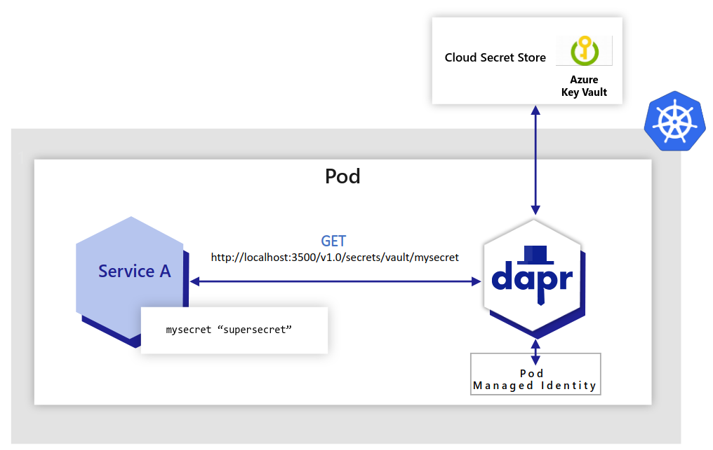

# Dapr Secret Store for Key Vault

## Overview

[Dapr (Distributed Application Runtime)](https://docs.dapr.io/concepts/overview/) is a versatile and event-driven runtime that simplifies the development of resilient, stateless, and stateful applications for both cloud and edge environments. It embraces the diversity of programming languages and developer frameworks, providing a seamless experience regardless of your preferences. Dapr encapsulates the best practices for building microservices into a set of open and independent APIs known as building blocks. These building blocks offer the following capabilities:

1. Enable developers to build portable applications using their preferred language and framework.
2. Are completely independent from each other, allowing flexibility and freedom of choice.
3. Have no limits on how many building blocks can be used within an application.

Dapr offers a built-in [secrets building block](https://docs.dapr.io/developing-applications/building-blocks/secrets/secrets-overview/) that makes it easier for developers to consume application secrets from a secret store such as Azure Key Vault, AWS Secret Manager, and Google Key Management, and Hashicorp Vault.

You can follow these steps to use Dapr's secret store building block:

1. Deploy the Dapr extension to your AKS cluster.
2. Set up a component for a specific secret store solution.
3. Retrieve secrets using the Dapr secrets API in your application code.
4. Optionally, reference secrets in Dapr component files.

You can watch [this overview video and demo](https://www.youtube.com/live/0y7ne6teHT4?si=3bmNSSyIEIVSF-Ej&t=9931) to see how Dapr secrets management works.

The secrets management API building block offers several features for your application.

- **Configure secrets without changing application code**: You can call the secrets API in your application code to retrieve and use secrets from Dapr-supported secret stores. Watch [this video](https://www.youtube.com/watch?v=OtbYCBt9C34&t=1818) for an example of how the secrets management API can be used in your application.
- **Reference secret stores in Dapr components**: When configuring Dapr components like state stores, you often need to include credentials in component files. Alternatively, you can place the credentials within a Dapr-supported secret store and reference the secret within the Dapr component. This approach is recommended, especially in production environments. Read more about [referencing secret stores in components](https://docs.dapr.io/operations/components/component-secrets/).
- **Limit access to secrets**: Dapr provides the ability to define scopes and restrict access permissions to provide more granular control over access to secrets. Learn more about [using secret scoping](https://docs.dapr.io/developing-applications/building-blocks/secrets/secrets-scopes/).

### Advantages

- Allows applications to retrieve secrets from various secret stores, including Azure Key Vault.
- Simplifies secret management with Dapr's consistent API.
- Supports Azure Key Vault integration with managed identities.
- Supports third-party secret stores, such as Azure Key Vault, AWS Secret Manager, and Google Key Management, and Hashicorp Vault.

### Disadvantages

- Requires injecting a sidecar container for Dapr into the pod, which may not be suitable for all scenarios.

## Hands-On Lab Prerequisites

### Configure Variables

The first step is setting up the name for a new or existing AKS cluster and Azure Key Vault resource in the [`scripts/00-variables.sh`](../../scripts/00-variables.sh) file, which is included and used by all the scripts in this sample.

The `SECRETS` array variable contains a list of secrets to create in the Azure Key Vault resource, while the `VALUES` array contains their values. 

### Create or Update AKS Cluster

You can use Bash script, [`01-create-or-update-aks.sh`](../../scripts/prerequisites/01-create-or-update-aks.sh), to create a new AKS cluster with the [az aks create](https://learn.microsoft.com/cli/azure/aks?view=azure-cli-latest#az-aks-create) command. This script includes the `--enable-oidc-issuer` parameter to enable the [OpenID Connect (OIDC) issuer](https://learn.microsoft.com/azure/aks/use-oidc-issuer) and the `--enable-workload-identity` parameter to enable [Microsoft Entra Workload ID](https://learn.microsoft.com/azure/aks/workload-identity-overview). If the AKS cluster already exists, the script updates it to use the OIDC issuer and enable workload identity by calling the [az aks update](https://learn.microsoft.com/cli/azure/aks?view=azure-cli-latest#az-aks-update) command with the same parameters.

### Create or Update Key Vault

You can use Bash script, [`02-create-key-vault-and-secrets.sh`](../../scripts/prerequisites/02-create-key-vault-and-secrets.sh), to create a new [Azure Key Vault](https://learn.microsoft.com/azure/key-vault/general/basic-concepts) if it doesn't already exist, and create a couple of secrets for demonstration purposes.

### Create Managed Identity and Federated Identity Credential

All the techniques use [Microsoft Entra Workload ID](https://learn.microsoft.com/azure/aks/workload-identity-overview). The repository contains a folder for each technique. Each folder includes Bash script, [`create-managed-identity.sh`](../../scripts/dapr-secret-store/02-create-managed-identity.sh).

The Bash script performs the following steps:

- It sources variables from two files: [`scripts/00-variables.sh`](../../scripts/00-variables.sh) and [`scripts/dapr-secret-store/00-variables.sh`](../../scripts/dapr-secret-store/00-variables.sh) .
- It checks if the specified resource group exists. If not, it creates the resource group.
- It checks if the specified managed identity exists within the resource group. If not, it creates a user-assigned managed identity.
- It retrieves the `principalId` and `clientId` of the managed identity.
- It retrieves the `id` of the Azure Key Vault resource.
- It assigns the `Key Vault Secrets User` role to the managed identity with the Azure Key Vault as the scope.
- It checks if the specified Kubernetes namespace exists. If not, it creates the namespace.
- It checks if a specified Kubernetes service account exists within the namespace. If not, it creates the service account with the annotations and labels required by [Microsoft Entra Workload ID](https://learn.microsoft.com/azure/aks/workload-identity-overview).
- It checks if a specified federated identity credential exists within the resource group. If not, it retrieves the OIDC Issuer URL of the specified AKS cluster and creates the federated identity credential.

## Hands-On Lab: Dapr Secret Store for Key Vault

[Distributed Application Runtime (Dapr)](https://docs.dapr.io/concepts/overview/) is is a versatile and event-driven runtime that can help you write and implement simple, portable, resilient, and secured microservices. Dapr works together with Kubernetes clusters such as [Azure Kubernetes Services (AKS)](https://learn.microsoft.com/azure/aks/what-is-aks) and [Azure Container Apps](https://learn.microsoft.com/azure/container-apps/overview) as an abstraction layer to provide a low-maintenance and scalable platform.

The first step is running Bash Script, [`01-install-dapr.sh`](../../scripts/dapr-secret-store/01-install-dapr.sh), to check if Dapr is actually installed on your AKS cluster, and if not, install the Dapr extension. For more information, see [Install the Dapr extension for Azure Kubernetes Service (AKS) and Arc-enabled Kubernetes](https://learn.microsoft.com/azure/aks/dapr?tabs=cli).

You can create a user-assigned managed identity for the workload, create federated credentials, and assign the proper permissions to it to read secrets from the source Key Vault using the [`02-create-managed-identity.sh`](../../scripts/dapr-secret-store/02-create-managed-identity.sh) Bash script. Then, you can run Bash script, [`03-create-secret-store.sh`](../../scripts/dapr-secret-store/03-create-secret-store.sh), to retrieve the `clientId` for the user-assigned managed identity used to access Key Vault and create a Dapr secret store component for the secret store CSI driver with Azure Key Vault provider. The YAML manifest of the Dapr component assigns the following values to the component metadata:

- Key Vault name to the `vaultName` attribute.
- Client id of the user-assigned managed identity to the `azureClientId` attribute.

The next step is deploying the demo application using Bash script, [`04-create-test-app.sh`](../../scripts/dapr-secret-store/04-create-test-app.sh),. The service account used by the Kubernetes deployment is federated with the user-assigned managed identity. Also note that the deployment is configured to use Dapr via the following Kubernetes annotations:

- `dapr.io/app-id`: The unique ID of the application. Used for service discovery, state encapsulation and the pub/sub consumer ID.
- `dapr.io/enabled`: Setting this paramater to true injects the Dapr sidecar into the pod.
- `dapr.io/app-port`: This parameter tells Dapr which port your application is listening on.

For more information on Dapr annotations, see [Dapr arguments and annotations for daprd, CLI, and Kubernetes](https://docs.dapr.io/reference/arguments-annotations-overview/).

You can run Bash script, [`05-list-secret.sh`](../../scripts/dapr-secret-store/05-list-secret.sh), to connect to the demo pod and print out the value of the two sample secrets stored in Key Vault.

## Conclusion

[Dapr Secret Store for Key Vault](https://docs.dapr.io/developing-applications/building-blocks/secrets/secrets-overview/) can be summarized as follows:
  - Allows applications to retrieve secrets from various secret stores, including Azure Key Vault.
  - Simplifies secret management with Dapr's consistent API.
  - Supports Azure Key Vault integration with managed identities.
  - Supports third-party secret stores, such as Azure Key Vault, AWS Secret Manager, and Google Key Management, and Hashicorp Vault.

## Resources

- [Dapr Secrets Overview](https://docs.dapr.io/developing-applications/building-blocks/secrets/secrets-overview/)
- [Azure Key Vault Secret Store in Dapr](https://docs.dapr.io/reference/components-reference/supported-secret-stores/azure-keyvault/)
- [Secrets management quickstart](https://docs.dapr.io/getting-started/quickstarts/secrets-quickstart/): Retrieve secrets in the application code from a configured secret store using the secrets management API.
- [Secret Store tutorial](https://github.com/dapr/quickstarts/tree/master/tutorials/secretstore): Learn how to use the Dapr Secrets API to access secret stores.
- [Authenticating to Azure for Dapr](https://docs.dapr.io/developing-applications/integrations/azure/azure-authentication/authenticating-azure/)
- [How-to Guide for Managed Identities with Dapr](https://docs.dapr.io/developing-applications/integrations/azure/azure-authentication/howto-mi/)