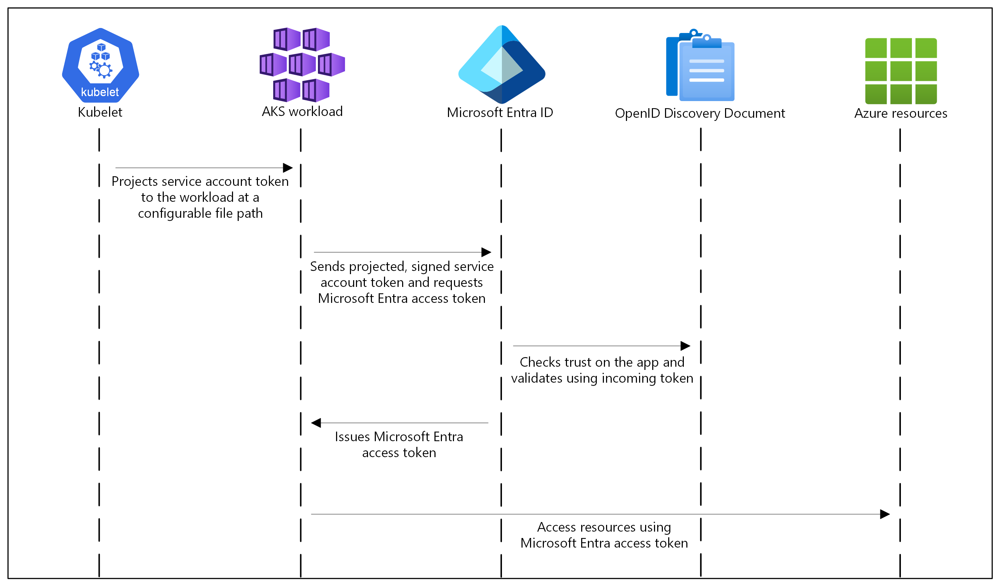

# Microsoft Entra Workload ID with Azure Kubernetes Service (AKS)

## Overview

In order for workloads deployed on an [Azure Kubernetes Services (AKS)](https://learn.microsoft.com/azure/aks/what-is-aks) cluster to access protected resources like [Azure Key Vault](https://learn.microsoft.com/azure/key-vault/general/basic-concepts) and Microsoft Graph, they need to have Microsoft Entra application credentials or managed identities. [Microsoft Entra Workload ID](https://learn.microsoft.com/azure/aks/workload-identity-overview) integrates with Kubernetes to federate with external identity providers.

To enable pods to have a Kubernetes identity, [Microsoft Entra Workload ID](https://learn.microsoft.com/azure/aks/workload-identity-overview) utilizes Service Account Token Volume Projection. This means that a Kubernetes token is issued and OIDC federation enables Kubernetes applications to securely access Azure resources using Microsoft Entra ID, based on service account annotations.

As shown in the following diagram, the Kubernetes cluster becomes a security token issuer, issuing tokens to Kubernetes Service Accounts. These tokens can be configured to be trusted on Microsoft Entra applications and user-defined managed identities. They can then be exchanged for an Microsoft Entra access token using the [Azure Identity SDKs](https://docs.microsoft.com/dotnet/api/overview/azure/identity-readme) or the [Microsoft Authentication Library (MSAL)](https://github.com/AzureAD/microsoft-authentication-library-for-dotnet).



In the [Microsoft Entra ID](https://learn.microsoft.com/entra/fundamentals/whatis) platform, there are two kinds of workload identities:

- [Registered applications](https://learn.microsoft.com/entra/identity-platform/application-model) have several powerful features, such as multi-tenancy and user sign-in. These capabilities cause application identities to be closely guarded by administrators. For more information on how to implement workload identity federation with registered applications, see [Use Microsoft Entra Workload Identity for Kubernetes with a User-Assigned Managed Identity](https://techcommunity.microsoft.com/t5/fasttrack-for-azure/use-azure-ad-workload-identity-for-kubernetes-in-a-net-standard/ba-p/3576218).

- [Managed identities](https://learn.microsoft.com/azure/active-directory/managed-identities-azure-resources/overview) provide an automatically managed identity in Microsoft Entra ID for applications to use when connecting to resources that support Microsoft Entra ID authentication. Applications can use managed identities to obtain Microsoft Entra tokens without having to manage any credentials. Managed identities were built with developer scenarios in mind. They support only the Client Credentials flow meant for software workloads to identify themselves when accessing other resources. For more information on how to implement workload identity federation with registered applications, see [Use Azure AD Workload Identity for Kubernetes with a User-Assigned Managed Identity](https://techcommunity.microsoft.com/blog/fasttrackforazureblog/use-azure-ad-workload-identity-for-kubernetes-with-a-user-assigned-managed-ident/3654928#M270).

### Advantages

- Transparently assigns a user-defined managed identity to a pod or deployment.
- Allows using Microsoft Entra integrated security and Azure RBAC for authorization.
- Provides secure access to Azure Key Vault and other managed services.

### Disadvantages

- Requires using Azure libraries for acquiring Azure credentials and using them to access managed services.
- Requires code changes.

## Hands-On Lab Prerequisites

### Configure Variables

The first step is setting up the name for a new or existing AKS cluster and Azure Key Vault resource in the [`prerequisites/00-variables.sh`](./artifacts/scripts/prerequisites/00-variables.sh) file.

The `SECRETS` array variable contains a list of secrets to create in the Azure Key Vault resource, while the `VALUES` array contains their values. 

### Create or Update AKS Cluster

You can use Bash script, [`01-create-or-update-aks.sh`](./artifacts/scripts/prerequisites/01-create-or-update-aks.sh), to create a new AKS cluster with the [az aks create](https://learn.microsoft.com/cli/azure/aks?view=azure-cli-latest#az-aks-create) command. This script includes the `--enable-oidc-issuer` parameter to enable the [OpenID Connect (OIDC) issuer](https://learn.microsoft.com/azure/aks/use-oidc-issuer) and the `--enable-workload-identity` parameter to enable [Microsoft Entra Workload ID](https://learn.microsoft.com/azure/aks/workload-identity-overview). If the AKS cluster already exists, the script updates it to use the OIDC issuer and enable workload identity by calling the [az aks update](https://learn.microsoft.com/cli/azure/aks?view=azure-cli-latest#az-aks-update) command with the same parameters.

### Create or Update Key Vault

You can use Bash script, [`02-create-key-vault-and-secrets.sh`](./artifacts/scripts/prerequisites/02-create-key-vault-and-secrets.sh), to create a new [Azure Key Vault](https://learn.microsoft.com/azure/key-vault/general/basic-concepts) if it doesn't already exist, and create a couple of secrets for demonstration purposes.

### Create Managed Identity and Federated Identity Credential

All the techniques use [Microsoft Entra Workload ID](https://learn.microsoft.com/azure/aks/workload-identity-overview). The repository contains a folder for each technique. Each folder includes Bash script, [`create-managed-identity.sh`](./artifacts/scripts/01-create-managed-identity.sh).

The Bash script performs the following steps:

- It sources variables from two files: [`prerequisites/00-variables.sh`](./artifacts/scripts/prerequisites/00-variables.sh) and [`scripts/00-variables.sh`](./artifacts/scripts/00-variables.sh) .
- It checks if the specified resource group exists. If not, it creates the resource group.
- It checks if the specified managed identity exists within the resource group. If not, it creates a user-assigned managed identity.
- It retrieves the `principalId` and `clientId` of the managed identity.
- It retrieves the `id` of the Azure Key Vault resource.
- It assigns the `Key Vault Secrets User` role to the managed identity with the Azure Key Vault as the scope.
- It checks if the specified Kubernetes namespace exists. If not, it creates the namespace.
- It checks if a specified Kubernetes service account exists within the namespace. If not, it creates the service account with the annotations and labels required by [Microsoft Entra Workload ID](https://learn.microsoft.com/azure/aks/workload-identity-overview).
- It checks if a specified federated identity credential exists within the resource group. If not, it retrieves the OIDC Issuer URL of the specified AKS cluster and creates the federated identity credential.

## Hands-On Lab: Use Microsoft Entra Workload ID with Azure Kubernetes Service (AKS)

Workloads deployed on an Azure Kubernetes Services (AKS) cluster require Microsoft Entra application credentials or managed identities to access Microsoft Entra protected resources, such as Azure Key Vault and Microsoft Graph. [Microsoft Entra Workload ID](https://learn.microsoft.com/azure/active-directory/develop/workload-identities-overview) integrates with Kubernetes capabilities to federate with external identity providers.

To enable pods to use a Kubernetes identity, Microsoft Entra Workload ID utilizes [Service Account Token Volume Projection](https://kubernetes.io/docs/tasks/configure-pod-container/configure-service-account/#serviceaccount-token-volume-projection) (service account). This allows for the issuance of a Kubernetes token, and [OIDC federation](https://kubernetes.io/docs/reference/access-authn-authz/authentication/#openid-connect-tokens) enables secure access to Azure resources with Microsoft Entra ID, based on annotated service accounts.

Utilizing the [Azure Identity client libraries](https://learn.microsoft.com/azure/aks/workload-identity-overview?tabs=dotnet#azure-identity-client-libraries) or the [Microsoft Authentication Library](https://learn.microsoft.com/azure/active-directory/develop/msal-overview) (MSAL) collection, alongside [application registration](https://learn.microsoft.com/azure/active-directory/develop/application-model#register-an-application), Microsoft Entra Workload ID seamlessly authenticates and provides access to Azure cloud resources for your workload.

You can create a user-assigned managed identity for the workload, create federated credentials, and assign the proper permissions to it to read secrets from the source Key Vault using the [`01-create-managed-identity.sh`](./artifacts/scripts/01-create-managed-identity.sh) Bash script. Then, you can run Bash script, [`02-create-demo-pod.sh`](./artifacts/scripts/02-create-demo-pod.sh), to retrieve the URL of the Azure Key Vault endpoint and then starts a demo pod in the `workload-id-test` namespace. The pod receives two parameters via environment variables:

- `KEYVAULT_URL`: The Azure Key Vault endpoint URL.
- `SECRET_NAME`: The name of a secret stored in Azure Key Vault.

The `Program` class contains the `Main` method, which initializes a [SecretClient](https://learn.microsoft.com/dotnet/api/azure.security.keyvault.secrets.secretclient?view=azure-dotnet) object using a custom credential class `MyClientAssertionCredential`. The `Main` method code retrieves the Key Vault URL and secret name from environment variables, checks if they are set, and then enters an infinite loop where it fetches the secret from Key Vault and prints it to the console every 10 minutes.

The `MyClientAssertionCredential` class extends [TokenCredential](https://learn.microsoft.com/dotnet/api/azure.core.tokencredential?view=azure-dotnet) and is responsible for authenticating with Microsoft Entra ID using a client assertion. It reads necessary environment variables for client ID, tenant ID, authority host, and federated token file path from the respective environment variables injected by [Microsoft Entra Workload ID](https://learn.microsoft.com/azure/aks/workload-identity-overview)into the pod.

| Environment variable         | Description                                                  |
| ---------------------------- | ------------------------------------------------------------ |
| `AZURE_AUTHORITY_HOST`       | The Microsoft Entra ID endpoint (https://login.microsoftonline.com/).                   |
| `AZURE_CLIENT_ID`            | The client ID of the Microsoft Entra ID registered application or user-assigned managed identity. |
| `AZURE_TENANT_ID`            | The tenant ID of the Microsoft Entra ID registered application or user-assigned managed identity. |
| `AZURE_FEDERATED_TOKEN_FILE` | The path of the projected service account token file.        |

The class uses the [ConfidentialClientApplicationBuilder](https://learn.microsoft.com/dotnet/api/microsoft.identity.client.confidentialclientapplicationbuilder?view=msal-dotnet-latest) to create a confidential client application that acquires tokens for the specified scopes. The `ReadJWTFromFSOrCache` method reads the JWT from the file system and caches it to minimize I/O operations. You can find the code, Dockerfile, and container image links for other programming languages in the table below.

| Language | Library | Code | Image | Example | Has Windows Images |
| -------- | ------- | ---- | ----- | ------- | ------------------ |
| **C#** | [microsoft-authentication-library-for-dotnet](https://github.com/AzureAD/microsoft-authentication-library-for-dotnet) | [Link](https://github.com/Azure/azure-workload-identity/tree/main/examples/msal-net/akvdotnet) | `ghcr.io/azure/azure-workload-identity/msal-net` | [Link](https://github.com/Azure/azure-workload-identity/tree/main/examples/msal-net/akvdotnet) | ✅ |
| **Go** | [microsoft-authentication-library-for-go](https://github.com/AzureAD/microsoft-authentication-library-for-go) | [Link](https://github.com/Azure/azure-workload-identity/tree/main/examples/msal-go) | `ghcr.io/azure/azure-workload-identity/msal-go` | [Link](https://github.com/Azure/azure-workload-identity/tree/main/examples/msal-go) | ✅ |
| **Java** | [microsoft-authentication-library-for-java](https://github.com/AzureAD/microsoft-authentication-library-for-java) | [Link](https://github.com/Azure/azure-workload-identity/tree/main/examples/msal-java) | `ghcr.io/azure/azure-workload-identity/msal-java` | [Link](https://github.com/Azure/azure-workload-identity/tree/main/examples/msal-java) | ❌ |
| **Node.JS** | [microsoft-authentication-library-for-js](https://github.com/AzureAD/microsoft-authentication-library-for-js) | [Link](https://github.com/Azure/azure-workload-identity/tree/main/examples/msal-node) | `ghcr.io/azure/azure-workload-identity/msal-node` | [Link](https://github.com/Azure/azure-workload-identity/tree/main/examples/msal-node) | ❌ |
| **Python** | [microsoft-authentication-library-for-python](https://github.com/AzureAD/microsoft-authentication-library-for-python) | [Link](https://github.com/Azure/azure-workload-identity/tree/main/examples/msal-python) | `ghcr.io/azure/azure-workload-identity/msal-python` | [Link](https://github.com/Azure/azure-workload-identity/tree/main/examples/msal-python) | ❌ |

The application code retrieves the secret value specified by the `SECRET_NAME` parameter and logs it to the standard output. Therefore, you can use Bash script, [`03-list-secret.sh`](./artifacts/scripts/03-list-secret.sh), to display the logs generated by the pod.

The script should generate an output similar to the following:

```bash
Reading logs from [demo-pod] pod...

START 02/10/2025 11:01:36 (demo-pod)
Your secret is admin
```

Alternatively, you can use the [Azure Identity client libraries](https://learn.microsoft.com/entra/identity/managed-identities-azure-resources/reference-managed-identity-libraries) in your workload code to acquire a security token from Microsoft Entra ID using the credentials of the registered application or user-assigned managed identity federated with the Kubernetes service account. You can choose one of the following approaches:

- Use `DefaultAzureCredential`, which attempts to use the `WorkloadIdentityCredential`.
- Create a `ChainedTokenCredential` instance that includes `WorkloadIdentityCredential`.
- Use `WorkloadIdentityCredential` directly.

The following table provides the minimum package version required for each language ecosystem's client library.

| Ecosystem | Library                                                      | Minimum version |
| :-------- | :----------------------------------------------------------- | :-------------- |
| .NET      | [Azure.Identity](https://learn.microsoft.com/dotnet/api/overview/azure/identity-readme) | 1.9.0           |
| C++       | [azure-identity-cpp](https://github.com/Azure/azure-sdk-for-cpp/blob/main/sdk/identity/azure-identity/README.md) | 1.6.0           |
| Go        | [azidentity](https://pkg.go.dev/github.com/Azure/azure-sdk-for-go/sdk/azidentity) | 1.3.0           |
| Java      | [azure-identity](https://learn.microsoft.com/java/api/overview/azure/identity-readme) | 1.9.0           |
| Node.js   | [@azure/identity](https://learn.microsoft.com/javascript/api/overview/azure/identity-readme) | 3.2.0           |
| Python    | [azure-identity](https://learn.microsoft.com/python/api/overview/azure/identity-readme) | 1.13.0          |

In the following code samples, `DefaultAzureCredential` is used. This credential type uses the environment variables injected by the Azure Workload Identity mutating webhook to authenticate with Azure Key Vault.

- [.NET](https://learn.microsoft.com/azure/aks/workload-identity-overview?tabs=dotnet#tabpanel_1_dotnet)
- [C++](https://learn.microsoft.com/azure/aks/workload-identity-overview?tabs=dotnet#tabpanel_1_cpp)
- [Go](https://learn.microsoft.com/azure/aks/workload-identity-overview?tabs=dotnet#tabpanel_1_go)
- [Java](https://learn.microsoft.com/azure/aks/workload-identity-overview?tabs=dotnet#tabpanel_1_java)
- [Node.js](https://learn.microsoft.com/azure/aks/workload-identity-overview?tabs=dotnet#tabpanel_1_javascript)
- [Python](https://learn.microsoft.com/azure/aks/workload-identity-overview?tabs=dotnet#tabpanel_1_python)

Here is a C# code sample that uses [DefaultAzureCredential](https://learn.microsoft.com/dotnet/api/azure.identity.defaultazurecredential?view=azure-dotnet) for user credentials.

```csharp
using Azure.Identity;
using Azure.Security.KeyVault.Secrets;

string keyVaultUrl = Environment.GetEnvironmentVariable("KEYVAULT_URL");
string secretName = Environment.GetEnvironmentVariable("SECRET_NAME");

var client = new SecretClient(
    new Uri(keyVaultUrl),
    new DefaultAzureCredential());

KeyVaultSecret secret = await client.GetSecretAsync(secretName);
```

## Conclusion

[Microsoft Entra Workload ID](https://learn.microsoft.com/azure/aks/workload-identity-overview) can be summarized as follows:
  - Transparently assigns a user-defined managed identity to a pod or deployment.
  - Allows using Microsoft Entra integrated security and Azure RBAC for authorization.
  - Provides secure access to Azure Key Vault and other managed services.

## Resources

- [Use Microsoft Entra Workload ID with Azure Kubernetes Service (AKS)](https://learn.microsoft.com/azure/aks/workload-identity-overview)
- [Deploy and Configure an AKS Cluster with Workload Identity](https://learn.microsoft.com/azure/aks/workload-identity-deploy-cluster)
- [Configure Cross-Tenant Workload Identity on AKS](https://learn.microsoft.com/azure/aks/workload-identity-cross-tenant)
- [Use Microsoft Entra Workload ID with a User-Assigned Managed Identity in an AKS-hosted .NET Application](https://github.com/paolosalvatori/azure-ad-workload-identity-mi)